<!-- ## Author Note{.unnumbered} -->
<!-- Correspondence concerning this article should be addressed to *Kyuri Park*, Computational -->
<!-- Science Lab, Informatics Institute, University of Amsterdam, PO Box 94323, Amsterdam, 1090 -->
<!-- GH, the Netherlands. E-mail: k.park@uva.nl.   -->

<!-- This work was supported by ZonMW under the project “*How can we best act upon -->
<!-- contextual factors that influence mental health in lower socio-economic groups? Insights offered -->
<!-- by system dynamics methodologies*” (dossier number: 05550032110014). *KP* and *VVV* -->
<!-- acknowledge this funding support. -->

<!-- **Acknowledgments.**   -->
<!-- The HELIUS study is conducted by the Amsterdam University Medical Centers, location AMC and the Public Health Service of Amsterdam. Both organisations provided core support for HELIUS. The HELIUS study is also funded by the Dutch Heart Foundation, the Netherlands Organization for Health Research and Development (ZonMw), the European Union (FP-7), and the European Fund for the Integration of non-EU immigrants (EIF). We are most grateful to the participants of the HELIUS study and the management team, research nurses, interviewers, research assistants and other staff who have taken part in gathering the data of this study. -->

<!-- **Author contributions (CRediT).**   -->
<!-- - Kyuri Park: Conceptualization, Methodology, Formal analysis, Writing – Original Draft.   -->
<!-- - Leonie K. Elsenburg: Data curation, Writing – Review & Editing.   -->
<!-- - Mary Nicolaou: Data curation, Writing – Review & Editing.   -->
<!-- - Karien Stronks: Data curation, Funding acquisition, Writing – Review & Editing.   -->
<!-- - Vítor V. Vasconcelos: Conceptualization, Methodology, Visualization, Supervision, Writing – Review & Editing. -->

<!-- **Conflicts of interest.** -->
<!-- The authors declare no conflicts of interest. -->

<!-- **Transparency and openness.** -->
<!-- The HELIUS dataset is available upon request from the Amsterdam UMC data access committee (see https://www.heliusstudy.nl). -->
<!-- The analysis code for the causal discovery and dynamical simulation models is publicly available at an open repository.   -->

<!-- *This study was not preregistered.* -->

<!-- \newpage -->

```{r, include=FALSE}
library(haven)
library(dplyr)
library(skimr)
library(furrr)
library(future)
library(tidyr)
library(GGally)
library(purrr)
library(gt)
library(corrplot)
library(psych)
library(FactoMineR)
library(factoextra)
library(fastICA)
library(umap)

```

```{r, include=FALSE, cache=TRUE}
# Load the dataset 
dat <- read_sav("../../data/helius_dat/HELIUS_LEONIE.sav") 

# Preprocess and scale the precariousness data
scaled_data <- dat %>%
  # Select precariousness-related variables
                # Employment Precariousness
  dplyr::select(H1_Arbeidsparticipatie, H1_WerkSit, H1_RecentErv8, 
                # Financial Precariousness
                H1_InkHhMoeite, H1_RecentErv9,                      
                # Housing Precariousness
                veilig_2012, vrz_2012, P_HUURWON,                   
                # Cultural Precariousness
                H1_Discr_sumscore, H1_SBSQ_meanscore, A_BED_RU,         
                # Social Precariousness
                H1_RecentErv5, H1_RecentErv6, H1_RecentErv7,       
                H1_SSQT, H1_SSQSa,                                  
                # Depression symptoms / sum scores
                H1_WlbvRecent1, H1_WlbvRecent2, H1_WlbvRecent3, H1_WlbvRecent4, H1_WlbvRecent5, H1_WlbvRecent6, H1_WlbvRecent7, H1_WlbvRecent_89, H1_WlbvRecent10, H1_PHQ9_sumscore,   
                # Ethnicity
                H1_etniciteit,
                # Ags
                H1_lft) %>%                                
  # Replace missing codes with NA 
  mutate(across(everything(), ~ na_if(.x, -9)), 
         across(everything(), ~ na_if(.x, -1))) %>%  
  # Remove NAs 
  na.omit() %>%
  # Convert all columns to numeric
  mutate(across(everything(), as.numeric),
        # Combine categories 5 to 10 into a single category (5-10 as one unemployed)
         H1_WerkSit = case_when(
    H1_WerkSit %in% c(5, 6, 7, 8, 9, 10) ~ 5,  
    .default = H1_WerkSit  # Keep other values as they are 
  ))  %>%
  # Reverse the values of specific variables (reverse transformation)
  mutate(across(c(H1_RecentErv8, H1_RecentErv9, veilig_2012, vrz_2012, 
                  H1_SBSQ_meanscore, A_BED_RU, H1_RecentErv5, H1_RecentErv6, 
                  H1_RecentErv7, H1_SSQT, H1_SSQSa), 
                ~ max(.x) - .x)) %>%
  # scale the data
  mutate(across(!c(H1_etniciteit, H1_lft), scale))
  # Apply Min-Max scaling to all columns
  # mutate(across(everything(), min_max_scaling))

# redefine colnames
colnames(scaled_data) <- c(
  "emp_stat",       # H1_Arbeidsparticipatie
  "work_sit",   # H1_WerkSit
  "unemp12",     # H1_RecentErv8
  "inc_dif",      # H1_InkHhMoeite
  "fincri12",# H1_RecentErv9
  "nb_safe",     # veilig_2012
  "nb_res",   # vrz_2012
  "nb_rent",         # P_HUURWON
  "discrim",      # H1_Discr_sumscore
  "hea_lit",       # H1_SBSQ_meanscore
  "cul_rec",      # A_BED_RU
  "rel_end12",   # H1_RecentErv5
  "frd_brk12", # H1_RecentErv6
  "conf12",         # H1_RecentErv7
  "soc_freq",      # H1_SSQT
  "soc_adq",      # H1_SSQSa
  "anh",       # H1_WlbvRecent1
  "dep",       # H1_WlbvRecent2
  "slp",       # H1_WlbvRecent3
  "ene",       # H1_WlbvRecent4
  "app",       # H1_WlbvRecent5
  "glt",       # H1_WlbvRecent6
  "con",       # H1_WlbvRecent7
  "mot",     # H1_WlbvRecent_89
  "sui",      # H1_WlbvRecent10
  "PHQsum",         # H1_PHQ9_sumscore
  "ethn",         # H1_etniciteit
  "age"          #"H1_lft" 
)
```

# Introduction

Mental health disorders represent a growing global health concern, especially in urbanized regions [@WHO_2022; @gruebner2017cities]. In 2019, one in eight people worldwide were living with a mental health condition, with the highest disability-adjusted life years (DALYs) due to mental and addictive disorders present in high-income countries such as those in Northern Europe, North America, and Australia [@rehm2019global; @WHO_2022]. Despite growing awareness, governments have struggled to design effective responses. Mental health outcomes arise from complex, multi-level dynamics between the social, economic, and spatial structures of urban environments—making both diagnosis and intervention design deeply challenging [@van2021advancing].

Recent work has shifted focus from individual-level vulnerability to broader social and structural determinants. While high-income nations show elevated overall DALYs, within-country disparities reveal that income inequality is a significant predictor of mental health burden [@rehm2019global]. Moreover, precarious working conditions, housing instability, and neighborhood disadvantage have all been linked to increased risk of depression and anxiety [@pevalin2017impact; @fone2014effect; @rugulies2023work; @ronnblad2019precarious]. This growing literature highlights that poor mental health is not merely a personal issue but one rooted in sustained socioeconomic stress and structural uncertainty.

Building on this, recent studies have introduced the concept of precariousness as a multidimensional condition characterized by instability and lack of control across several life domains, including employment, finances, housing, social relations, and cultural belonging [@elsenburg2025clustering; @mckee2017living]. This broader view reveals how different forms of insecurity can co-occur and compound, forming an ecosystem of risk. However, despite growing evidence of association between precariousness and mental health, a fundamental question remains unresolved: *How do these factors causally influence one another?* Most existing studies rely on cross-sectional correlations, leaving open questions about directionality and feedback.\footnote{For conventional effect-size context in HELIUS (e.g., regression-based associations between socioeconomic exposures and depressive symptoms), see the broader HELIUS epidemiologic and measurement literature, for example: Elsenburg et al. (2025), Galenkamp et al. (2017), and Stronks et al. (2013, 2020).} Without stronger causal insight, it remains difficult to identify priority targets for intervention or to anticipate and quantify intended and unintended effects.


This study aims to characterize candidate causal structure linking precariousness and depression and to examine how alternative plausible internal configurations could shape responses to stress-reducing scenarios. Specifically, we ask: \textit{How does the internal configuration of the precariousness–depression relationship affect system responses under external reductions in stress?}
Clarifying whether financial stress more often precedes depression, whether depression more often feeds back into social precariousness, or whether both processes operate together matters because these alternatives imply different priorities for prevention and intervention.
To answer this, we combine two approaches. First, we use cycle-capable causal discovery algorithms to infer equivalence-class constraints among domain-specific precariousness factors and depressive symptoms under possible latent confounding and feedback.
By examining both aggregated measures (depression sum score and a composite precariousness index) and disaggregated variables (individual depressive symptoms and specific life-domain indicators), we capture broad patterns of conditional dependence as well as finer-grained candidate pathways.
Second, we translate the most stable motifs and remaining uncertainty into a deliberately simplified dynamical model that simulates how depression and precariousness could co-evolve under external stress reduction.
This model is used as a scenario tool to probe how system properties—especially feedback strength—can shape the speed and persistence of response. For example, when feedback from precariousness to depression is weaker, depression responds more directly to stress reduction but can also rebound more quickly when stress is reintroduced; when feedback is stronger, responses can be slower but more persistent.


In much of the public health and social epidemiology literature, analyses of precariousness and depression necessarily rely on associational summaries (e.g., regressions or correlations), even when the substantive discussion is implicitly causal in terms of drivers, upstream factors, or mutual reinforcement. Our goal is to show what additional structural and uncertainty information becomes visible when one uses causal-structure learning outputs and then carries those insights forward into scenario-based simulations, rather than implicitly treating one fitted model as “the” causal story.


Because HELIUS is cross-sectional and many orientations are unstable across algorithms and CI tests, we do not treat the discovery output as identifying a unique mechanism of mutual reinforcement. Instead, we use causal discovery to summarize which adjacencies and motifs are stable versus indeterminate, and we carry the remaining uncertainty forward into scenario simulations that illustrate how different plausible feedback regimes could shape intervention trajectories.
Our contribution is primarily integrative. We provide an applied workflow that (i) estimates candidate structural constraints among precariousness and depression under latent confounding and possible feedback, (ii) makes uncertainty explicit via resampling and a prespecified specification grid, and (iii) carries the stable motifs and remaining uncertainty forward into scenario simulations rather than fixing a single directed graph.


# Methods

## Data

We use data from the HELIUS (HEalthy LIfe in an Urban Setting) study [@stronks2013unravelling; @snijder2017cohort]. It captures the diverse population of the city of Amsterdam by including the six main ethnic groups and provides comprehensive health and lifestyle data, including depressive symptoms as measured by the PHQ-9 [@galenkamp2017measurement]. 
To operationalize precariousness, we follow the domain framework described in prior work [@elsenburg2025clustering] and compile candidate indicators for each domain. Before entering the causal discovery pipeline, we screened these candidates for measurement quality and within-domain coherence among the precariousness indicators (e.g., missingness, variability, and inter-item correlations). 
This resulted in five precariousness factors: three structural domains (employment, housing, and social relationships) and two domains capturing recent life stressors (financial and relational). Each factor is composed of multiple observed variables, as outlined below. Additional details on the HELIUS study and the factor extraction process are provided in the [Appendix](#sec-appendix).


-   Employment precariousness: `emp_stat` (current employment status), `work_sit` (nature of work situation).
-   Social precariousness: `soc_freq` (frequency of social contact), `soc_adq` (perceived adequacy of social support).
-   Housing precariousness: `nb_safe` (neighborhood safety), `nb_res` (access to neighborhood resources), `nb_rent` (proportion of rental housing), `cul_rec` (availability of cultural resources).
-   Recent relational stressors: `frd_brk12` (experience of a friendship breakup), `conf12` (recent interpersonal or relational conflict).
-   Recent financial stressors: `fincri12` (experience of a financial crisis), `inc_dif` (difficulty managing household income).


Following data cleaning and normalization procedures, the analytical sample comprises 21,628 individuals. 
Because participation and item nonresponse may be selective, and because the analytic sample excludes individuals with missing data on key variables, the observed associations may, in principle, partly reflect selection mechanisms in addition to population-level relationships.
In addition to the five identified precariousness factors, we computed an overall precariousness score by summing these five factor scores, thereby capturing a composite measure of accumulated precariousness across domains. 

In the causal-discovery analyses, recent financial stressors (\textit{S.fin}), social precariousness (\textit{P.soc}), and the overall precariousness score are treated as measured proxies for broader underlying conditions that may be influenced by policy or program levers. For example, \textit{S.fin} may reflect acute financial strain that could in principle be shifted by income support, debt relief, bill assistance, or related forms of financial support; \textit{P.soc} may reflect social connectedness and barriers to participation that could in principle be shifted by social support or access-enhancing interventions; and the overall precariousness score is interpreted as a composite proxy for accumulated disadvantage across domains rather than as a single directly manipulable target. Interpreting changes in these proxy measures as policy-relevant shifts requires additional assumptions: (i) the intervention produces a stable change in the proxy as measured; (ii) the proxy is measured comparably across relevant groups and settings; (iii) the intervention does not have large effects on depression through pathways that bypass the targeted proxy; and (iv) a given change in the proxy corresponds to a meaningful change in the target construct it is intended to represent. In the simulation analyses, however, the only externally implemented intervention is a reduction in the financial stress proxy; depression and social precariousness evolve endogenously through the model couplings.

Depression is represented using the PHQ-9 [@kroenke2001phq], both as a total sum score and as individual symptom scores. In the subsequent causal discovery analysis, we explore the relationship between depression and precariousness using both aggregated scores and their disaggregated components. See @fig-dist for the overall distributions of the variables used in the analysis.


```{r echo=FALSE, fig.align='center', fig.height=5, fig.width=8, out.width="90%", cache=TRUE}
#| fig-cap: >
#|   ***Distributions of variables with density overlay.***  
#|   This shows the distributions of the variables used in the causal analysis, plotted as histograms with overlaid density estimates. The x-axis represents the value of each variable after preprocessing. The y-axis shows the corresponding estimated probability density.
#|   ***P.emp*** = *employment precariousness*;  ***P.hou*** = *housing precariousness*;  ***P.soc*** = *social precariousness*;  ***S.fin*** = *recent financial stressors*;  ***S.rel*** = *recent relational stressors*;  ***precariousness*** = *overall precariousness*;  ***PHQsum*** = *PHQ-9 sum score*;  ***anh*** = *anhedonia*;  ***app*** = *appetite*;  ***con*** = *concentration*;  ***dep*** = *depressed mood*;  ***ene*** = *energy*;  ***glt*** = *guilty*;  ***mot*** = *motor*;  ***slp*** = *sleep*;  ***sui*** = *suicidal*.
#|   
#| label: fig-dist

clust_data <- scaled_data |> 
  mutate(
    P.emp = rowMeans(cbind(emp_stat, work_sit)),
    P.soc = rowMeans(cbind(soc_freq, soc_adq)),
    P.hou = rowMeans(cbind(nb_safe, nb_res, nb_rent, cul_rec)),
    S.rel = rowMeans(cbind(frd_brk12, conf12)),
    S.fin = rowMeans(cbind(fincri12, inc_dif)),
    precariousness = P.emp + P.soc + P.hou + S.rel + S.fin
  ) |>
  dplyr::select(17:34) |>
  as.data.frame()

# Reshape the data to long format
clust_data_long <- clust_data |>
  dplyr::select(-age, -ethn) |>
  pivot_longer(cols = everything(), names_to = "variable", values_to = "value")

# Plot distributions with density lines
ggplot(clust_data_long, aes(x = value)) +
  geom_histogram(aes(y = after_stat(density)), fill = "lightblue", color = "white", bins = 15) +  # Use density for histogram
  geom_density(adjust=2, linewidth=0.3, color = "gray", alpha = 0.5) +  # Add density line in red
  facet_wrap(~ factor(variable, levels =c("P.emp", "P.hou", "P.soc", "S.fin", "S.rel", "precariousness", "anh", "app", "con", "dep", "ene", "glt", "mot", "slp", "sui", "PHQsum")), scales = "free") +
  labs(x = "", y = "") +
  theme_minimal()

```


## Causal Discovery{#sec-analysis}

To characterize candidate causal structures and obtain constraints on possible ancestral relations between precariousness and depression, we use constraint-based causal discovery algorithms that allow for feedback loops and latent confounding. Specifically, we apply the *Fast Causal Inference* (FCI) and *Cyclic Causal Inference* (CCI) algorithms, both of which allow latent confounding and can represent certain classes of feedback/cyclicity under additional assumptions [@mooij2020constraint; @strobl2019].
For reference, we also include the *PC* algorithm, one of the most widely used methods for acyclic causal discovery [@spirtes2001causation].
While our full analysis includes results from three causal discovery algorithms—FCI, CCI, and PC—we focus on FCI in the main text, as it offers a strong balance between flexibility and theoretical soundness. FCI accommodates latent confounding and can represent certain classes of feedback under additional assumptions/extensions, making it well-suited for the complexity of our data [@mooij2020constraint]. The PC algorithm is included for reference but relies on more restrictive assumptions, such as acyclicity and no unmeasured confounding. CCI, while capable of modeling cycles explicitly, has its own theoretical limitations; for example, its output may not fully preserve the d-separation properties of the true causal graph [@strobl2019]. Results from both PC and CCI are provided in the [Appendix](#sec-appendix) ([@sec-cci; @sec-pc]) for completeness and comparison. For readers interested in detailed explanations of the algorithms, edge interpretations, and graph types (e.g., PAG, MAAG, CPDAG), as well as algorithmic assumptions and limitations, please refer to the [Appendix](#sec-appendix) ([@sec-causalprimer]); a more tutorial-style walkthrough with simulations is provided in @park2024discovering. These discovery procedures do not explicitly model participation or missingness mechanisms. We therefore interpret inferred adjacencies as conditional on the analyzed sample, and selection-induced associations cannot be ruled out without additional information about the selection process.


The output of these algorithms is interpreted as an equivalence-class summary of edge marks compatible with the conditional independencies observed in the data under stated assumptions. That is, the algorithms do not identify a single causal graph; rather, they return a class of graphs compatible with the data, and the endpoint marks indicate which possible ancestral relations are constrained and which remain unresolved. In cross-sectional settings with measurement error and finite samples, edge orientations are often not uniquely determined and may vary across algorithms, conditional independence tests, and resampling. We therefore interpret stable adjacencies (link existence) as consistently recovered links under the tested specifications and treat edge orientations as hypothesis-generating rather than as identified directionality or causal effects.


A key challenge in applying these algorithms to the HELIUS dataset is that many variables are non-Gaussian and likely exhibit nonlinear relationships. While kernel-based conditional independence tests (such as KCIT) are well-suited for capturing such complex dependencies, they are computationally intensive—scaling quadratically with sample size due to the need to invert large kernel matrices—making them impractical for large datasets like HELIUS [@rahimi2007random].
To address this, we use the Randomized Conditional Correlation Test (RCoT), a scalable nonparametric alternative that approximates kernel methods using random Fourier features, replacing expensive kernel-matrix computations with lower-dimensional feature operations and thereby substantially reducing runtime at large sample sizes [@strobl2019approximate; @zhang2012kernel]. RCoT improves computational feasibility relative to KCIT and allows sensitivity analyses at HELIUS sample size, but it does not remove the fundamental loss of statistical power that typically occurs as the conditioning set size $|Z|$ increases. For further details, see @sec-rcot.


We examine the causal structure using three complementary approaches:

1. Aggregate-level analysis: relationships between five domain-specific precariousness factors and the PHQ-9 sum score.
2. Fully disaggregated analysis: relationships between individual precariousness items and individual depressive symptoms.
3. Mixed analysis: relationships between individual symptoms and a composite index of overall precariousness.

The aggregate analysis reduces dimensionality and yields interpretable summaries of how domains of precariousness relate to overall depression severity. However, it may obscure finer-grained effects. The disaggregated analysis allows for precise mapping of which symptoms are influenced by (or influence) specific precariousness conditions, but it introduces complexity due to the high dimensionality and distributional properties of the data. The mixed approach, in turn, integrates these perspectives by examining how individual symptoms respond to cumulative precariousness across domains.


To summarize the stability of the estimated graph structure between depression and precariousness variables, we implement a comprehensive bootstrapped causal discovery procedure. This procedure systematically varies key analysis parameters across a grid of configurations, enabling us to assess the stability of inferred relationships under different settings.
Specifically, we vary four main components:

* Significance levels for conditional independence tests: $\alpha$ = 0.01 and 0.05.
* Stability thresholds: 0.5, 0.6, 0.7, and 0.8, which determine how frequently an edge must appear across bootstraps to be retained.
* Conditional independence (CI) tests: Gaussian CI test (partial correlation) and RCoT (a nonparametric test).
* Causal discovery algorithms: FCI, CCI, and PC.

For each unique parameter combination (2 significance levels × 4 thresholds × 2 CI tests = 16 settings), we run 100 bootstrap samples per algorithm for the aggregated analyses (see Step 1 in @fig-workflow). For symptom-level analyses, which are more computationally intensive, we use 30 bootstrap samples per setting.[^5]

[^5]: For symptom-level analyses, we further improve computational efficiency by fixing the skeleton structure—the undirected network of potential connections—using a consensus graph derived from all three algorithms (with $\alpha = 0.01$ and the RCoT test). This allows subsequent analyses to focus exclusively on estimating edge directions, avoiding the repeated and costly computation of skeletons, and thus substantially reducing runtime.

To summarize these results, we apply a two-level aggregation strategy:

1. **Within each condition** (fixed $\alpha$, threshold, CI test, and algorithm), we identify the most frequently occurring edge type (e.g., arrowhead, circle, none) across bootstraps for each pair of variables (Step 2 in @fig-workflow).
2. **Across conditions**, we summarize edge marks by their most frequent edge mark across the specification grid. If two or more edge marks are tied for the highest frequency, we label the edge as uncertain and draw it as dashed in the final graph (Step 3 in @fig-workflow). Dashed edges therefore indicate indeterminacy across specifications and are not treated as directionally informative.

This summarization process is repeated separately for each causal discovery algorithm (FCI, CCI, PC), yielding a single summary graph per algorithm. These final graphs represent only the most stable and consistent relationships across a wide range of plausible parameterizations, improving interpretability and making sensitivity to analysis choices explicit.
To support transparency, each final graph is accompanied by a matrix summarizing the relative frequency of each edge type for every variable pair, enabling readers to assess the degree of uncertainty or agreement underlying each connection.

The purpose of this pipeline is not to produce a single definitive causal graph, but to make sensitivity to modeling choices explicit. Accordingly, the summaries can yield absent edges and indeterminate endpoint marks (ties/dashed edges). We treat these outcomes as substantive indicators of limited information in the data and refrain from resolving them by selecting a preferred specification.


Our procedure is intended to summarize how sensitive the estimated graphs are to bootstrap resampling and to a prespecified set of analytic choices. The bootstrap-based edge-type proportions are interpreted as descriptive relative frequencies of returned edge marks. That is, they summarize how often a given edge mark is returned across bootstrap resamples and specifications, rather than providing hypothesis-test p-values or a formal statistical guarantee. We treat stability as a descriptive property with two components. First, \emph{adjacency stability} refers to how consistently an edge is recovered across bootstrap resamples and specifications. Second, \emph{orientation stability} refers to how consistently the same endpoint-mark pattern is recovered when an adjacency is present.

We consider the analysis to show limited stability under any of the following failure modes: (i) an adjacency appears only under a narrow subset of specifications (for example, only at one significance level or only for one CI test); (ii) an adjacency is frequently absent under small changes in the specification grid; or (iii) an orientation is inconsistent across specifications, including frequent reversals between $X \rightarrow Y$ and $Y \rightarrow X$, or a large share of undetermined endpoint marks. In these cases we report the adjacency as unstable or the direction as indeterminate (for example, using dashed edges for ties) and we do not treat the direction as evidence for a causal ordering.


```{r}
#| label: fig-workflow
#| fig-cap: "***Causal discovery workflow applied across all three algorithms (FCI, CCI, and PC)***. The process involves three main steps: (1) bootstrapping the dataset to create multiple resampled datasets; (2) estimating causal graphs under varying parameter configurations; and (3) summarizing results by identifying the most frequent edge type across bootstraps and settings to construct a final stable graph."
#| fig-align: center
#| out-width: 90%

knitr::include_graphics("img/simsetup.pdf")

```


## Modeling Dynamics between Precariousness and Depression
To explore how internal system structure shapes responses to external support, we implement a high-level computational model that formalizes core motifs highlighted by the causal discovery analysis. Rather than attempting to replicate the full estimated causal graph, this model abstracts the essential structure into a compact, tractable system focused on dynamic interactions between depression and social precariousness, both influenced by financial stress.
The dynamical model is intentionally reduced and should be read as a scenario model anchored to the most stable cross-specification motifs (in particular, the \textit{S.fin}--depression--\textit{P.soc} motif), rather than as a dynamical implementation of the full estimated graph. This reduction is motivated by the discovery results themselves: beyond a small number of recurring adjacencies, many endpoint marks are unstable or method-dependent in this cross-sectional setting, so translating the full graph would risk hard-coding directions that are not stably supported across specifications.\footnote{
Because the graph-learning outputs are defined by conditional-independence constraints, whereas our dynamical calibration matches second-order moments (variances/covariances), the scenario model is not expected to reproduce the full PAG/MAAG conditional-independence structure, and we do not interpret it as such.} We use a linear stochastic differential equation model as a transparent baseline scenario; nonlinear threshold mechanisms (e.g., sigmoidal or state-dependent coupling) are not included here because they introduce additional functional-form parameters that are weakly constrained by the cross-sectional data, and we discuss them as a natural extension.

As illustrated in [@fig-concept], the model includes three components: social precariousness $P_i(t)$, depressive symptoms $D_i(t)$, and a static individual-specific external stressor $S_i$, representing financial stress. Depression and precariousness are modeled as coupled state variables that influence each other over time, with $S_i$ acting as a shared input. These dynamics are formalized as a pair of linear stochastic differential equations (SDEs):

$$
\begin{aligned}
dP_i(t) &= \lambda_P \big( \alpha_{PS} S_i + \alpha_{PD} D_i(t) - P_i(t) \big) \, dt + \sigma_P \, dW_{P,i}(t) \\
dD_i(t) &= \lambda_D \big( \alpha_{DS} S_i + \alpha_{DP} P_i(t) - D_i(t) \big) \, dt + \sigma_D \, dW_{D,i}(t)
\end{aligned}
$$

  
Here, $D_i(t)$ denotes the depressive state and $P_i(t)$ denotes the level of social precariousness for individual $i$ at time $t$, with $S_i$ representing a static, individual-specific external stressor (financial stress). The parameters $\lambda_D$, $\lambda_P$, as well as the coefficients $\alpha$ and noise terms $\sigma$, are assumed to be constant across individuals and time.
The parameters $\lambda_D$ and $\lambda_P$ govern the timescales over which $D_i(t)$ and $P_i(t)$ adjust toward their respective input-driven target states. The coefficients $\alpha_{DS}$ and $\alpha_{PS}$ quantify the direct effects of the external stressor $S_i$ on depression and precariousness, respectively, while $\alpha_{DP}$ and $\alpha_{PD}$ capture the mutual influence between the two dynamic processes. Stochastic fluctuations are introduced via the independent Wiener processes $dW_{D,i}(t)$ and $dW_{P,i}(t)$, scaled by their respective volatility parameters $\sigma_D$ and $\sigma_P$.
This linear structure offers a transparent and analytically tractable framework for modeling how exogenous variation in financial stress may propagate through individual dynamics of depression and precariousness.
Under a stationarity assumption, the model can be calibrated to match empirical second-order moments (variances and covariances). Because feedback strength is not uniquely identified from cross-sectional data and can remain difficult to identify even with longitudinal data when time resolution is limited or measurement error is substantial, we treat $\alpha_{DP}$ as a free parameter and derive the remaining coefficients analytically conditional on $\alpha_{DP}$. We then vary $\alpha_{DP}$ over its admissible range and interpret the resulting family of models as a sensitivity analysis.
The resulting steady-state distribution of the model aligns with empirical measures: PHQ-9 total score (PHQsum) for depression, and the derived social precariousness factor (P.soc) for social precarity. The full calibration procedure is described in [@sec-calibration].


<!-- Here, $D$ denotes depression, $P$ denotes social precariousness, and $S$ is the external stressor associated with financial stress. The parameters $\lambda_D$ and $\lambda_P$ control the timescales over which each variable adjusts toward its input-driven target state. The coefficients $\alpha_{PS}$ and $\alpha_{DS}$ quantify the direct effects of the stressor on $P$ and $D$, while $\alpha_{DP}$ and $\alpha_{PD}$ represent the cross-influences between depression and precariousness. Stochastic fluctuations are introduced through the noise terms $\sigma_P, dW_P$ and $\sigma_D, dW_D$, with $dW_P$ and $dW_D$ representing independent Wiener processes. -->
<!-- This linear structure offers a transparent and analytically tractable framework for examining how variations in external financial stress influence the population-level dynamics of depression and social precariousness. Crucially, the model's simplicity enables direct calibration from empirical data: all parameters can be derived analytically from observed variances and covariances in the HELIUS cohort. The following  [@sec-calibration] details the procedure used to perform this calibration. -->


```{r}
#| label: fig-concept
#| fig-cap: '***High-level schematic of the dynamic model structure used in simulation.*** Arrows represent influence coefficients $\alpha$, corresponding to the terms in the system of stochastic differential equations. $D_i(t)$ and $P_i(t)$ denote depressive symptoms and social precariousness for individual $i$, with $S_i$ representing static financial stress. In the simulation model, financial stress is specified as an external input to both depressive symptoms and social precariousness, and depression and precariousness are specified to be mutually coupled. Arrows depict influence pathways that are operationalized in our quantitative model. This abstraction is informed by the causal discovery results and provides the structure for the simulation experiments.'
#| fig-align: center
#| out-width: 40%


knitr::include_graphics("img/conceptmodel.pdf")
```


### Model Calibration {#sec-calibration}

In our linear model, all parameters are derived analytically to reproduce the empirical second-order moments observed in the HELIUS dataset. The system treats depression ($D$) and social precariousness ($P$) as jointly evolving under the influence of a shared external stressor ($S$), forming a coupled system of Ornstein–Uhlenbeck processes. Under the assumption of stationarity, the steady-state covariances between these variables admit closed-form solutions for the system’s structural parameters.

We fix the adjustment rates $\lambda_D = \lambda_P = 1$, which normalizes the time scale given the cross-sectional nature of the HELIUS data.
To resolve the remaining degree of freedom, we treat the feedback from precariousness to depression ($\alpha_{DP}$) as a free parameter, and we solve algebraically for all other coefficients — specifically the direct effects of stress ($\alpha_{DS}, \alpha_{PS}$), the reverse feedback from depression to precariousness ($\alpha_{PD}$), and the noise terms ($\sigma_D, \sigma_P$). These solutions are expressed as closed-form functions of the empirical covariances: $\mathrm{Var}(D)$, $\mathrm{Var}(P)$, $\mathrm{Var}(S)$, $\mathrm{Cov}(D, P)$, $\mathrm{Cov}(D, S)$, and $\mathrm{Cov}(P, S)$.

This structure creates a family of analytically calibrated models, each consistent with the same observed covariances but differing in their internal configuration. We constrain the space of valid solutions by imposing that all structural parameters must be positive, reflecting the assumption that stress and precariousness contribute adversely to depression. This constraint restricts the allowable range of $\alpha_{DP}$ to approximately $[0, 0.698]$ (see Appendix [@sec-analcalibration]).

@fig-tradeoff illustrates how the remaining parameters adjust as $\alpha_{DP}$ increases to maintain consistency with the empirical covariances. As $\alpha_{DP}$ increases, $\alpha_{PD}$ tends to decrease, reflecting a compensatory trade-off between the mutual influences of depression and precariousness. This interplay helps preserve the model’s match with observed covariances, without requiring major shifts in external input strength. Meanwhile, the external coupling terms — $\alpha_{DS}$ and $\alpha_{PS}$ — also shift to absorb variance in a way that maintains alignment with the empirical data. Notably, the noise amplitudes $\sigma_D$ and $\sigma_P$ decline slightly as $\alpha_{DP}$ increases. This indicates that more of the observed variability is captured by deterministic interactions, with less left to be explained by stochastic fluctuations.

This remaining flexibility reflects non-identifiability of feedback strength in cross-sectional data. We therefore treat the resulting one-parameter family as a sensitivity analysis: each member matches the same empirical covariance structure, but differs in internal feedback configuration, allowing us to examine how intervention trajectories depend on plausible feedback regimes. Each represents a different plausible causal architecture, offering insight into how internal dynamics modulate the system's responsiveness to external stress — even when the observed covariances remain unchanged.


```{r}
#| label: fig-tradeoff
#| fig-cap: >
#|   ***Trade-off curves showing how calibrated parameters vary with coupling strength.***
#|   Each line tracks how a model parameter changes with the coupling coefficient ($\alpha_{DP}$), which quantifies the influence of precariousness on depression in the dynamical model. These adjustments preserve consistency with empirical covariances from the HELIUS data.  
#|   Together, the curves illustrate that multiple internal configurations are equally compatible with the data, highlighting how system dynamics can reorganize as coupling strength varies.
#| fig-align: center
#| out-width: 85%
 
knitr::include_graphics("img/param_tradeoff.pdf")
```


### Intervention Simulation

To evaluate how internal structure affects system responsiveness, we simulate a family of linear models under an external support scenario. Each model corresponds to a different value of $\alpha_{DP}$, representing the strength of influence from social precariousness to depression. The range spans from 0 (no coupling) to 0.65 (maximal admissible value), with all other parameters derived analytically to preserve the empirical covariances observed in the HELIUS data (see @fig-tradeoff).

In each simulation, we represent external support by shifting the financial stress proxy for individual $i$ ($S_i$) downward by a common proportion toward the lowest observed value in the cohort. This is a stylized representation of stress-reducing policies that are expected to lower acute financial strain (for example, income support or benefits, debt relief, or related forms of financial assistance). We do not intervene directly on depression $D_i(t)$ or social precariousness $P_i(t)$. Instead, $D_i(t)$ and $P_i(t)$ evolve endogenously in response to the change in $S_i$ through the model couplings. We simulate 1000 virtual individuals per model, sampling baseline stress levels from the empirical distribution and lowering those levels by the same proportion (intervention level).

We assess the system’s behavior using two complementary approaches:

- Snapshot analysis captures the average levels of depression ($D$) and precariousness ($P$) at selected time points ($t = 100$, $300$, $500$) following intervention onset. Since all linear models converge to the same equilibrium, this highlights how internal feedback affects the speed and pathway of adjustment.

- Full trajectory simulation tracks system dynamics over time for two representative models: one with minimal ($\alpha_{DP} = 0$) and one with maximal ($\alpha_{DP} = 0.65$) feedback. Each simulation includes an intervention period followed by its withdrawal, revealing differences in reactivity, delay, and recovery stability.

Together, these simulations demonstrate how internal structure governs not just whether change occurs, but how it unfolds — shaping the pace, persistence, and variability of response to external support.


<!-- ## Data Availibility {.unnumbered} -->
<!-- The data used in this study come from the HELIUS (HEalthy LIfe in an Urban Setting) cohort. Due to privacy and ethical restrictions, the raw HELIUS data are not publicly available. Researchers who wish to access the data can submit a request to the HELIUS study team via the study website (<https://heliusstudy.nl>), following the governance procedures of the HELIUS Executive Board. -->

<!-- ## Code Availibility {.unnumbered} -->
<!-- All analysis scripts used for causal discovery, model calibration, and simulation are available at <https://github.com/KyuriP/Precarity_HELIUS>. The repository contains documented R code and instructions for reproducing the analyses reported in this manuscript. -->


# Results

## Causal Structure Linking Precariousness and Depression


Because the estimated graphs are equivalence-class outputs and HELIUS is cross-sectional, we use these results to generate hypotheses rather than to identify causal effects. We distinguish adjacency stability, meaning whether a connection is repeatedly recovered, from orientation stability, meaning how consistently endpoint marks suggest the same possible direction across specifications. Unresolved orientations are treated as indeterminacy rather than as evidence for or against a directional effect. When stability is limited, we report the relation as indeterminate and refrain from directional interpretation.


\begin{abbrbox}
\textbf{Abbreviations used in Results.}
\emph{P.emp} = employment precariousness; \emph{P.hou} = housing precariousness; \emph{P.soc} = social precariousness; \emph{S.fin} = recent financial stressors; \emph{S.rel} = recent relational stressors; \emph{PHQsum} = PHQ-9 sum score; \emph{anh} = anhedonia; \emph{app} = appetite; \emph{con} = concentration; \emph{dep} = depressed mood; \emph{ene} = energy; \emph{glt} = guilt; \emph{mot} = psychomotor change; \emph{slp} = sleep disturbance; \emph{sui} = suicidal ideation.
\end{abbrbox}

### Depression as sum score
@fig-sum provides a summary of how precariousness factors collectively influence and are influenced by overall depression severity, focusing on the estimated graph structure between precariousness factors (\textit{P.hou, P.emp, P.soc, S.rel, S.fin}) and the depression sum score (PHQsum), as returned by the FCI algorithm.
<!-- As described in [@sec-analysis], dashed edges indicate ties, and the edge endpoint at which the tie occurs is marked by a bold horizontal bar. -->

<!-- The causal graph in panel (a) highlights key pathways in the relationships between precariousness factors and depression (*PHQsum*).  -->
In panel (a) we see that employment precariousness (\textit{P.emp}) and social precariousness (\textit{P.soc}) are adjacent to *PHQsum*, but their endpoint marks do not consistently support an interpretation in which they precede depression; in fact, the most frequent patterns are often unresolved or oriented in the opposite direction. By contrast, financial stress (\textit{S.fin}) shows the most stable adjacency with \textit{PHQsum} and is more often oriented in a direction compatible with \textit{S.fin} preceding \textit{PHQsum}. While *P.emp* and *P.soc* are generally not recognized as causes of other precariousness factors, *S.fin* emerges as a potential cause, as indicated by its circle edge endpoint. This pattern is summarized in the edge-type proportion matrix shown in panel (b). Panel (b) reports the proportion of bootstrap resamples and analysis specifications in which each edge mark is selected, rather than p-values or significance levels. Values close to 1 indicate that a given edge mark is selected frequently across resamples and specifications, whereas values close to 0 indicate that it is selected rarely.

<!-- The matrix plot can be interpreted such that the symbol in matrix[$i$, $j$] represents the relationship $i -~[symbol] \  j$. For example, if matrix[$i$, $j$] is > and matrix[j, i] is $\circ$, then the inferred relationship is $i \circarrow j$.  In the table, different edge types are represented by distinct colors: light gray for the absence of an edge, blue for circles, green for arrowheads, and coral for arrowtails. The colors are blended based on the proportion of each edge type, with higher proportions increasing the opacity of the corresponding color, making dominant symbols more visually prominent.  -->

Relational stress (\textit{S.rel}) shows a less consistent pattern across specifications. In several settings, its links with depression and \textit{S.fin} include edge marks that are compatible with latent confounding, and orientations vary across algorithms and CI tests. Its connection to \textit{P.soc} is comparatively unstable: the proportion matrix in @fig-sum-2 indicates that this adjacency is often absent, and when present the endpoint marks are frequently indeterminate. Housing precariousness (\textit{P.hou}) does not show a stable adjacency with depression in the aggregated summaries, but it is more consistently connected to \textit{P.emp} and \textit{S.fin}. For these links, directional information remains limited. Across bootstrap resamples and specifications, endpoint marks adjacent to P.hou are often unresolved, so the summaries do not distinguish whether \textit{P.hou} precedes \textit{P.emp}, follows it, or whether both are linked through unobserved confounders.

The findings from the CCI algorithm (see [@fig-sum-cci]) are largely consistent with those from the FCI analysis, with one key distinction: CCI shows greater ambiguity in the directional relationship between *S.fin* and *PHQsum*: CCI assigns an arrowhead at the \textit{PHQsum} endpoint on the \textit{S.fin}–\textit{PHQsum} adjacency in roughly 50\% of bootstraps, while the remaining cases display an undirected (circle) endpoint.

Overall, CCI introduces greater uncertainty in edge orientations relative to FCI, yielding more undirected endpoints and more frequent bidirectional (confounded) edges, which in turn contribute to a slightly higher overall count of arrowheads when directions are inferred. 
<!-- Despite this, the skeleton structure and overall causal directions derived from CCI align well with the results of the FCI algorithm. For example,  -->

Importantly, we do not treat the FCI summary as "more correct" than the CCI summary. Rather, we treat the contrast as a reflection of how different algorithms encode uncertainty in this cross-sectional, finite-sample setting. In particular, CCI tends to return a higher share of bidirectional/confounded-type patterns and fewer strongly constraining tail marks, which we interpret as a more conservative treatment of ancestry under latent confounding/cyclicity and finite-sample variability. Accordingly, we report the stable \textit{S.fin}–\textit{PHQsum} adjacency as the main cross-method finding, and we treat any directional tendency (when present) as hypothesis-generating rather than identified.

Both algorithms frequently return adjacencies linking the stressors (\textit{S.rel}, \textit{S.fin}) and \textit{P.soc}. Across specifications, endpoint orientations are often consistent with the stressors preceding \textit{P.soc}, although a substantial fraction remain undetermined. With respect to depression, there is limited directional support for \textit{P.soc} $\rightarrow$ \textit{PHQsum}. When \textit{P.soc} and \textit{PHQsum} are adjacent, orientations more often point toward \textit{P.soc} or remain indeterminate. Similarly, \textit{P.emp} is rarely oriented as an upstream parent of its neighboring variables (\textit{P.hou}, \textit{PHQsum}, \textit{S.fin}). Inferred directions more often point toward \textit{P.emp} or remain unresolved. Finally, the links between \textit{P.hou} and (\textit{P.emp}, \textit{S.fin}) commonly include circle endpoints, indicating that the data and assumptions do not uniquely determine whether \textit{P.hou} is upstream, downstream, or connected via latent confounding.


Causal relationships between five precariousness factors and depression sum score (*PHQsum*), as estimated using the FCI algorithm across bootstrapped samples.
(a) Aggregated causal graph showing the most frequent edge types across bootstraps. Dashed edges indicate ties, with a bold horizontal bar marking where the tie occurs.
(b) Proportion matrix summarizing edge types across all bootstraps. Each matrix cell $[i, j]$ represents how often an edge from variable $i$ to variable $j$ exhibited a particular edge mark—arrowhead, tail, circle, or no edge—adjacent to $j$. The edge mark in matrix$[i,j]$ reflects the orientation of the edge ending at $j$. For example, if matrix$[i, j]$ shows a green arrowhead ($>$) and matrix$[j, i]$ shows a blue circle ($\circ$), then the inferred relationship is $i \circarrow j$. Edge types are encoded by distinct colors: green for arrowheads, coral for arrowtails, blue for circles, and light gray for absence of an edge. Colors are blended according to how often each edge type appears, with greater opacity indicating a higher proportion of runs yielding that edge type.\footnote{Within each run, the discovery algorithms rely on conditional independence tests that return p-values used to decide whether variables are conditionally independent at a chosen significance level $\alpha$. However, the proportion matrices we report do not display these p-values. Instead, each entry shows the proportion of bootstrap resamples and pre-specified analysis specifications in which a given edge mark (arrowhead, tail, circle, or no edge) is returned. Because these frequencies are not derived from a null-hypothesis test and are not calibrated to control Type I error, they should be interpreted as stability summaries rather than as p-values or significance levels.}

\textbf{Main takeaway.} In the aggregated analysis, the most stable cross-method finding is the \textit{S.fin}–\textit{PHQsum} adjacency; other precariousness domains show weaker or less stable connections, and orientations are frequently unresolved.


```{r}
#| layout-ncol: 2
#| label: fig-sum
#| fig-cap: '\textit{\textbf{Graph summaries of associations between precariousness factors and overall depression severity.}} In the FCI outputs, financial stress (\textit{S.fin}) shows the most consistent adjacency with depression severity (\textit{PHQsum}) across bootstrap resamples and specifications, whereas other precariousness domains show weaker or more variable connections. **(a)** Aggregated FCI summary graph showing the most frequent edge marks across bootstraps. The summary emphasizes the consistently recovered adjacency between \textit{S.fin} and \textit{PHQsum}, while other connections are more variable across specifications. Dashed edges indicate ties in the most frequent edge mark across the specification grid, with a bold horizontal bar marking where the tie occurs. **(b)** Proportion matrix (selection frequencies across bootstrap resamples) summarizing edge marks across all bootstraps: each matrix cell $[i, j]$ indicates how often a given edge from variable $i$ to variable $j$ exhibited a particular edge mark (e.g., arrowhead, tail, or circle) adjacent to $j$. Green indicates arrowheads, coral tails, blue circle marks, and gray absence of an edge. Colors are blended and shaded by frequency, with dominant symbols appearing more opaque. For example, matrix[$\mathit{S.fin}$, $\mathit{PHQsum}$] shows a green arrowhead and matrix[$\mathit{PHQsum}$, $\mathit{S.fin}$] shows a coral tail, together indicating an edge mark pattern consistent with $\mathit{S.fin} \rightarrow \mathit{PHQsum}$ in the majority of bootstrapped graphs.'
#| fig-subcap: 
#|   - "FCI PAG"
#|   - "Proportion matrix"
#| fig-align: center
#| out-width: 100%

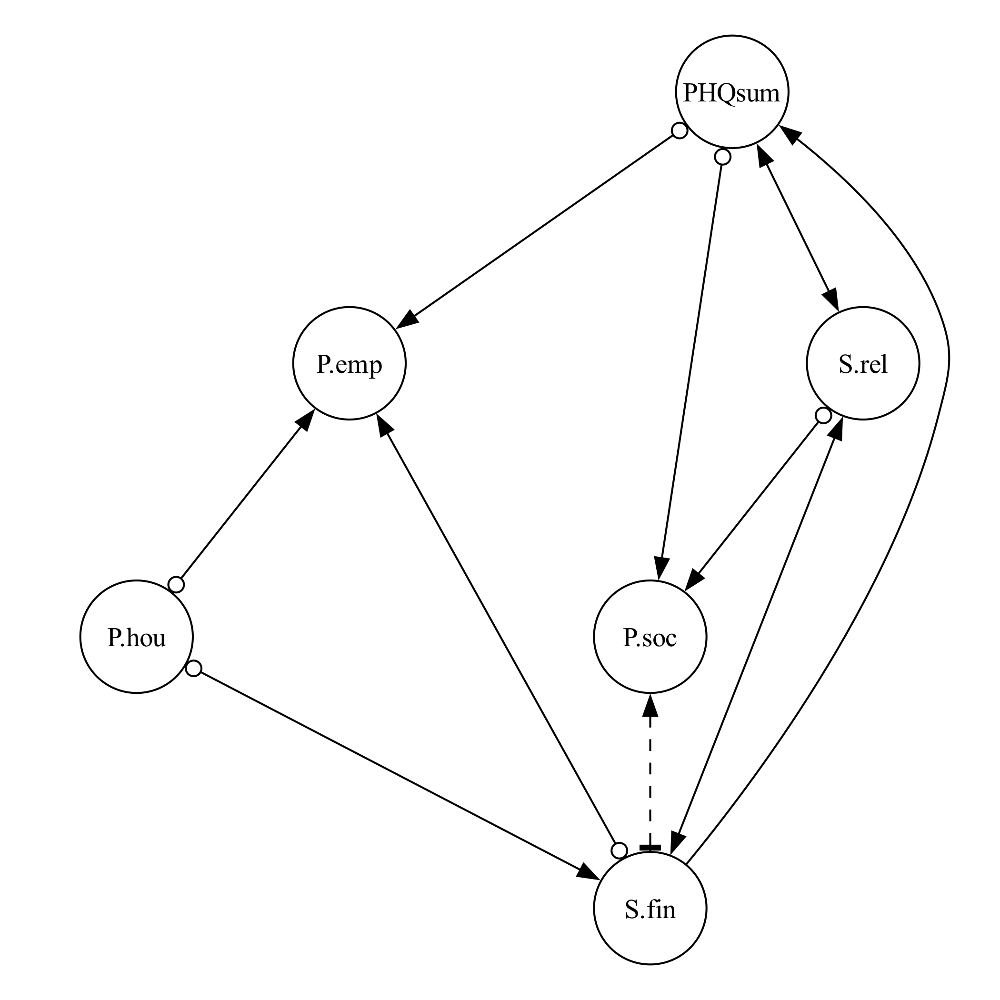
knitr::include_graphics("img/depsum_mat_fci.pdf")

```


### Individual depression symptom

Moving from the sum score representation to the disaggregated symptom-level graph provides a more granular perspective on the causal relationships between precariousness factors and depression symptoms. Unlike the sum score graph, which aggregates all symptoms into a single measure, the symptom-level graph in @fig-sym reveals the heterogeneity in how specific symptoms (*con* (concentration), *slp* (sleep), *ene* (energy), *app* (appetite), *mot* (motor), *sui* (suicidal), *anh* (anhedonia), *glt* (guilt), and *dep* (depressed mood)) are influenced by, and in turn influence, different forms of precariousness. 

@fig-sym-1 reveals a strong interdependence among symptoms and suggests much presence of latent confounders, as indicated by numerous bidirectional edges. 
<!-- As before, dashed edges denote ties, with specific ties marked by bold horizontal bars.  -->
In @fig-sym-2, the proportion matrix indicates that arrowheads are the most frequently inferred edge type. However, circle endpoints are particularly common for *anh*, *slp*, *ene*, and *sui*, reflecting uncertainty in the causal direction among these symptoms. Notably, the only arrowtail connection appears between *dep* and *anh*, suggesting that anhedonia is a potential cause of depressed mood.

Looking at the symptom-precariousness connections, one of the key patterns is that ties are most frequently found in the relationships between individual symptoms and precariousness factors. This suggests that these causal links may be less stable across different conditions. Closer examination reveals that most ties arise due to discrepancies between the Gaussian CI test and the RCoT test—with Gaussian CI favoring arrowheads and RCoT more often predicting the absence of an edge.

<!-- This discrepancy likely arises from a combination of factors.  -->
<!-- As the analysis moves from aggregated to disaggregated variables, the number of CI tests increases substantially, leading to a loss of statistical power. With more variables being conditioned on, the effective sample size per test diminishes, making it harder to detect subtle dependencies. Over-conditioning—controlling for too many variables—can also obscure real relationships, resulting in false negatives. -->
<!-- Beyond these statistical power issues, the underlying assumptions of the two CI tests contribute to their divergence. RCoT is a nonparametric test that captures both linear and nonlinear dependencies without assuming a specific distributional form. However, it is more conservative and requires larger sample sizes, especially in high-dimensional settings. In contrast, the Gaussian CI test is based on partial correlations and assumes linear Gaussian relationships, making it more permissive and more likely to detect weak or spurious associations. -->
<!-- As a result, it is common to see edges where Gaussian CI suggests a directional relationship, while RCoT indicates no edge. In the proportion matrix, this appears as a 50–50 tie between absence and arrowhead symbols.  -->
<!-- This systematic divergence illustrates the broader challenge of causal discovery in high-dimensional data: different statistical assumptions can lead to different conclusions about whether—and in which direction—variables are causally related. -->

Despite these differences, some consistent patterns emerge across both CI tests, particularly in the case of *S.fin*, which appears to be connected to nearly all other variables—though many of these connections are marked by ties, reflecting uncertainty in directionality. One exception is the stronger evidence suggesting that *S.fin* may cause changes in *app*, while its relationships with other symptoms, such as *ene*, *mot*, and *dep*, remain ambiguous.
Similarly, *P.soc* exhibits numerous connections with depressive symptoms, with most edges pointing toward *P.soc* rather than outward from it. This suggests that depressive symptoms, particularly *dep* and *glt*, may contribute to worsening social precariousness rather than the other way around. Additionally, *anh* also shows signs of a potential causal influence on *P.soc*, reinforcing the idea that social precariousness is more often a consequence rather than a driver of depressive symptoms.

Other precariousness factors exhibit more uncertainty but still notable relationships. *S.rel* is connected to *slp*, *glt*, and *app*, though directionality remains unclear in many cases. *P.emp* also connects to symptoms like *slp*, *mot*, and *con*, but, like *S.rel*, these relationships exhibit a 50/50 split in directionality, reflecting uncertainty in the inferred causal paths.
In line with the aggregated graph in @fig-sum, *P.hou* does not appear to have any direct relationship with depression symptoms but consistently shows associations with *P.emp* and *S.fin*. The causal relationships among precariousness factors remain largely unchanged from the aggregated analysis, with *S.fin* exhibiting the strongest tendency to influence other precariousness factors.

Among depressive symptoms, *dep*, *glt*, and *slp* appear to be the most connected to precariousness factors, while *P.soc* has the most connections with symptoms, predominantly as a recipient rather than a driver of influence. Within the symptom network, *slp*, *sui*, and *anh* emerge as causally influential symptoms, as they exhibit more outgoing arrows compared to other symptoms. On the other hand, *con*, *mot*, *dep*, and *glt*, despite having high connectivity, predominantly receive incoming arrows, indicating they are more likely effects rather than causes.
Considering both symptom-precariousness connections and symptom-level dynamics, *slp* emerges as a central symptom, given its strong ties to precariousness factors and its influential role within the symptom network.
<!-- This suggests that sleep issues could be an initiating symptom, particularly sensitive to relational stress and employment precariousness.  -->
*P.soc* appears to function as a bridge between the depression and precariousness subsystems, as depressive symptoms appear to feed back into social precariousness, reinforcing a self-sustaining dynamic between depression and precarious conditions.

Finally, the results from CCI are largely consistent with those from FCI, but with some key differences. CCI tends to favor arrowheads more frequently, resulting in a greater number of bidirectional edges, which suggests a higher involvement of latent confounders. Additionally, CCI exhibits more tie situations, though, similar to FCI, most ties occur between absence and arrowhead edges, reflecting the discrepancy between the Gaussian CI test and RCoT—where the Gaussian test favors arrowheads, while RCoT more often suggests the absence of an edge. For a detailed visualization of the CCI-derived graph and proportion matrix, see @fig-sym-cci.

\textbf{Main takeaway.} At the symptom level, sleep disturbance (\textit{slp}) is highly connected, and multiple configurations are consistent with depressive symptoms feeding into social precariousness (\textit{P.soc}), but many symptom–precariousness directions are unstable across CI tests and specifications.


\newgeometry{top=10mm, bottom=20mm, left=40mm, right=40mm}
```{r}
#| label: fig-sym
#| layout-nrow: 2
#| fig-cap: "***Causal pathways linking individual depressive symptoms and precariousness factors.*** **(a)** Aggregated FCI graph summarizing the most frequent edge types across bootstraps. The pattern suggests that depressed mood (*dep*), guilt (*glt*), and anhedonia (*anh*) often direct influence into social precariousness (*P.soc*), indicating that *P.soc* is more likely a consequence of core depressive symptoms than their cause. Sleep disturbance (*slp*) emerges as central within the broader network, with strong ties to several precariousness factors. Housing precariousness (*P.hou*) remains largely disconnected from symptoms, instead linking to employment and financial stress. **(b)** Proportion matrix showing edge-type frequencies across bootstraps. Arrowheads are the most frequent endpoint overall, while circle marks—reflecting uncertainty or latent confounding—are particularly common for *slp*, *anh*, *ene*, and *sui*."
#| fig-subcap: 
#|   - "FCI PAG"
#|   - "Proportion matrix"
#| fig-align: center
#| out-width: 60%

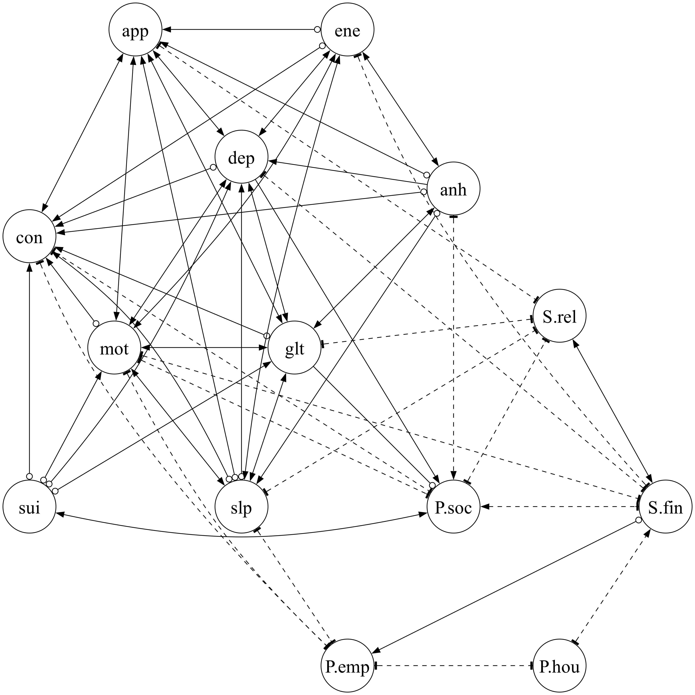
knitr::include_graphics("img/symptom_mat_fci.pdf")

```

\restoregeometry


### Precariousness as sum score

Lastly, we examine the relationships between individual symptoms and overall precariousness, an aggregated measure represented by the sum of five precariousness factors. This analysis provides a complementary perspective, capturing broader patterns that may not be evident in the disaggregated symptom-precariousness analysis. By aggregating precariousness factors into a single score, this approach may capture distributed relationships across different precariousness factors that were previously overlooked in the disaggregated analysis.

Unlike the disaggregated graph in @fig-sym, the aggregated symptom-precariousness graph (@fig-presum-1) shows greater certainty in causal directions, with ties occurring only in edges involving the overall precariousness factor.
This is even more evident in the proportion matrix (@fig-presum-2), where symptom-to-symptom interactions almost fully converge to a single edge type. Additionally, all symptom interactions are connected either through bidirectional edges or a combination of an arrowhead and a circle, suggesting a strong presence of latent confounders.


Examining the symptom-precariousness connections, we observe a stronger overall trend of depressive symptoms influencing precariousness, rather than the other way around. Specifically, *anh*, *dep*, and *slp* frequently emerge as sources of influence on precariousness, whereas *app*, *glt*, and *mot* exhibit more uncertainty in directionality, often resulting in circle endpoints. This pattern suggests that when precariousness factors are aggregated, the dominant causal flow is from depressive symptoms to precariousness, rather than precariousness driving depression. Particularly, *dep* emerges as the strongest predictor of precariousness, exhibiting the highest proportion of arrowtails, consistent with findings from the disaggregated analysis.

Comparing this with the CCI-derived graph (@fig-presum-cci), several key differences stand out. The CCI results reveal that most symptoms are interconnected through bidirectional edges, suggesting a strong presence of latent confounders. However, *dep* appears to be a distinct exception, as it is predominantly caused by nearly all other symptoms, with one exception *sui*, which does not contribute to *dep*. Similarly, *con* is influenced by multiple symptoms, albeit with weaker support compared to *dep*.
Most interestingly, the CCI results highlight a distinct feedback loop between *dep* and overall precariousness, represented by a tail-tail edge (\textemdash \). This suggests a possible reinforcing cycle between depression and overall precariousness, where depression not only arises from precarious conditions but also contributes to their persistence, creating a self-sustaining dynamic.

<!-- Across multiple levels of analysis, our results point to a consistent and directional link between precariousness and depression. Financial stress (*S.fin*) emerges as a particularly robust and modifiable upstream driver: in both aggregated and disaggregated models, it shows strong and stable causal influence on depressive symptoms. By contrast, other forms of precariousness—particularly social precarity—more often appear as outcomes rather than antecedents of depression, frequently receiving rather than sending causal arrows. Among symptoms, *dep* and *slp* stand out for their centrality and connections to precariousness factors, with *dep* also implicated in potential feedback loops with social precarity (*P.soc*). These findings motivate the use of a simplified three-node model in the simulation—capturing depression, financial stress, and social precarity—as it preserves the key dynamic motifs observed in the causal graphs while enabling tractable exploration of system-level responses to stress-reducing interventions. -->

Across multiple levels of analysis, our results show consistent connections between precariousness and depression, with the most stable adjacency linking financial stress (\textit{S.fin}) to depressive outcomes. Across many specifications, edge marks are more often compatible with financial stress preceding depression, although directionality remains partly indeterminate and varies with modeling choices. Other precariousness dimensions, especially social precariousness, more often appear downstream of depressive symptoms or remain unresolved. At the symptom level, \textit{dep} and \textit{slp} stand out for their connectivity to precariousness factors, with several configurations consistent with feedback between these factors involving social precariousness. On this basis, we use a simplified three-node simulation model of depression, financial stress, and social precarity to examine how alternative plausible feedback strengths, which cannot be identified from cross-sectional data, shape trajectories under stress-reducing scenarios.

\textbf{Main takeaway.} When precariousness is aggregated, symptom-to-precariousness orientations appear more consistent than in the fully disaggregated setting, and some configurations are compatible with feedback between depression and overall precariousness, though directionality remains method-dependent.


\newgeometry{top=10mm, bottom=20mm, left=40mm, right=40mm}


```{r}
#| layout-nrow: 2
#| label: fig-presum
#| fig-cap: "***Causal pathways between overall precariousness and individual depressive symptoms.***  **(a)** Aggregated FCI graph summarizing the most frequent edge types across bootstraps. The edge pattern indicates that depressive symptoms—particularly anhedonia (*anh*), depressed mood (*dep*), and sleep disturbance (*slp*)—more often direct influence into overall precariousness, rather than the reverse. By contrast, symptoms such as appetite (*app*), guilt (*glt*), and motor disturbance (*mot*) show greater uncertainty in directionality. **(b)** Proportion matrix showing edge-type frequencies across bootstraps. Symptom-to-symptom connections converge strongly on single edge types, with most interactions either bidirectional or split between arrowhead and circle marks, consistent with the presence of latent confounders."
#| fig-subcap: 
#|   - "FCI PAG"
#|   - "Proportion matrix"
#| fig-align: center
#| out-width: 60%


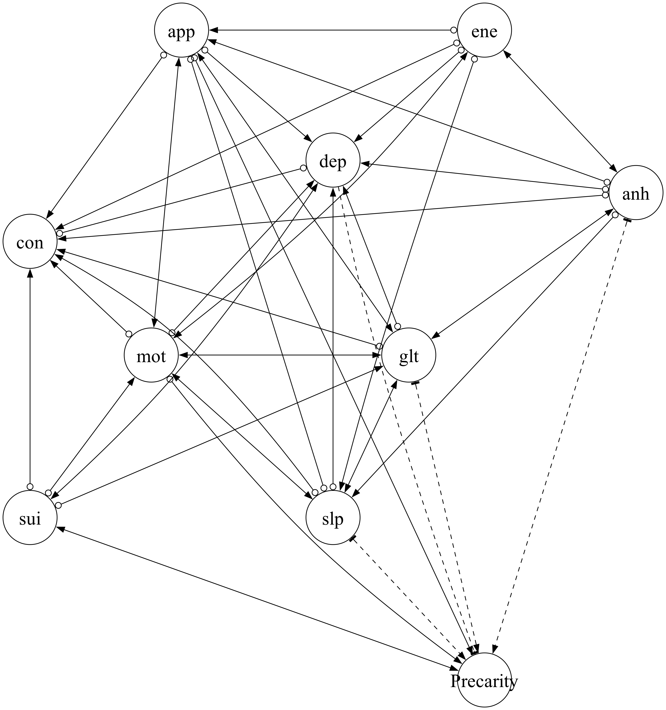
knitr::include_graphics("img/presum_mat_fci.pdf")
```

\restoregeometry


## Simulating the Dynamics Between Precariousness and Depression Under Intervention

To assess how internal structure influences the system’s responsiveness to external support, we simulated a set of linear models consistent with the observed data. The data constrain the strength of connections from financial stress to both depression and precariousness, as well as the total strength of feedback between these two domains. However, within these bounds, multiple feedback configurations are compatible with the data, differing in the dominant direction of influence. We characterize these alternatives by the strength of the pathway from precariousness to depression ($\alpha_{DP}$; see trade-off in @fig-tradeoff).
For each model, we generate a virtual population of 1,000 individuals, with baseline financial stress sampled from the HELIUS data.
We then simulate an external intervention that reduces each individual’s financial stress ($S$) proportionally toward the minimum observed value in the dataset. 
While individuals begin with different baseline stress levels, the intervention applies a shared proportional reduction across the population. This intervention defines the external input, while variation in $\alpha_{DP}$ reflects different assumptions about internal feedback from precariousness to depression.
We examine system behavior in two complementary ways: (1) by analyzing average levels of depression and precariousness at selected time points following intervention onset, and (2) by simulating full temporal trajectories under sustained intervention followed by recovery, using two representative cases at the extremes of the $\alpha_{DP}$ range.

@fig-intervention summarizes how variation in $\alpha_{DP}$ shapes system-level responses to external support.
<!-- Panel A shows the mean levels of depression ($D$) and precariousness ($P$) at time steps 100, 300, and 500, with the x-axis indicating the strength of external support, defined as the proportional reduction of $S$ toward its minimum observed value. -->
<!-- Each line represents a different scenario with a different $\alpha_{DP}$, color-coded from low (purple) to high (yellow). -->
In Panel A, during the early phase of intervention, depression and precariousness exhibit contrasting patterns. Depression declines more rapidly in scenarios with lower $\alpha_{DP}$, where its dynamics are driven more directly by the external stressor $S$. 
As $\alpha_{DP}$ increases, $D$ becomes more dependent on precariousness ($P$), which itself adjusts more slowly—delaying the depressive response.
Precariousness, by contrast, shows slightly faster early reductions in scenarios with higher $\alpha_{DP}$. This reflects a shift in influence: as $\alpha_{DP}$ increases, $P$ becomes more directly responsive to $S$ (via increasing $\alpha_{PS}$) and less influenced by $D$, allowing it to adjust more promptly to changes in the stressor.


Despite these short-term differences, all scenarios ultimately converge to similar steady-state levels under sustained intervention. As the system approaches convergence, some variation remains, particularly in $P$, where gradients between models are still visible. 
<!-- By step 500, trajectories have nearly fully aligned across all configurations, consistent with the shared equilibrium structure of the linear system.  -->
This convergence highlights that the key distinctions lie not in whether intervention is effective, but in how quickly and through which pathways change unfolds.


Panel B shows full time trajectories for two representative cases: one with minimal internal feedback ($\alpha_{DP} = 0$) and one at the upper admissible limit ($\alpha_{DP} = 0.65$). In both, there is a temporary intervention period. When $\alpha_{DP} = 0$, depression responds rapidly to the reduction in stress and rebounds shortly after support is withdrawn. In contrast, when $\alpha_{DP}$ is high, $D$ responds more gradually and recovers more slowly—reflecting its increased dependence on the slower-changing $P$.
Precariousness declines in both scenarios during intervention and returns to baseline afterward, but with a slightly sharper drop in the higher $\alpha_{DP}$ condition. 
This occurs because $P$ becomes more directly responsive to $S$, as consistency with the data requires $\alpha_{PS}$ to increase with $\alpha_{DP}$ (see @fig-tradeoff). These parameter shifts reflect trade-offs needed to preserve the empirical covariances, with further details provided in Appendix @sec-analcalibration.


These asymmetries further highlight how internal structure—not just external inputs—shapes the system’s trajectory. Specifically, changes in coupling parameters reconfigure how stress reduction propagates through the system, altering the speed and pathway of response even when long-run outcomes remain unchanged.

\newgeometry{top=15mm, bottom=20mm, left=40mm, right=40mm}

```{r}
#| label: fig-intervention
#| fig-align: center
#| out-width: 80%
#| fig-cap: >
#|   ***System response to external intervention across variations in internal structure.***
#|   **(A)** *Mean levels of depression ($D$) and precariousness ($P$) at key time points.* At time steps 100, 300, and 500, we compare models that differ in the coupling coefficient $\alpha_{DP}$, which represents the strength of depression’s influence on precariousness in the dynamical model. The x‑axis shows intervention strength, defined as the proportional reduction of financial stress ($S$) relative to its baseline (with higher values indicating more external financial support). Each line corresponds to a different model, color-coded from weak (purple) to strong (yellow) coupling. Models with weaker coupling exhibit faster early reductions in $D$, while stronger coupling shifts the response toward $P$, producing more immediate declines in precariousness. **(B)** *Full temporal trajectories under weak coupling versus strong coupling.* Time series illustrate intervention onset (step 300) and withdrawal (step 1500) for two representative cases: one with no coupling ($\alpha_{DP} = 0$) and one with strong coupling ($\alpha_{DP} = 0.65$). Depression responds more gradually and persistently under strong coupling, whereas precariousness adjusts more quickly.


knitr::include_graphics("img/intervention_linear.pdf")
```

\restoregeometry


# Discussion

This study combined constraint-based causal discovery and dynamical modeling to investigate how depression and socioeconomic precariousness interact and how their internal structure modulates responsiveness to intervention.
Consistent with prior work linking financial strain to psychological distress [@lund2010poverty; @ezzy1993unemployment],
the most consistent finding from the causal discovery stage is the stable adjacency between recent financial stressors (\textit{S.fin}) and depression (PHQsum / symptoms) across bootstrap resamples and across our prespecified specification grid. Beyond this adjacency, directional information is substantially less stable: endpoint marks vary across algorithms and CI tests, and many orientations remain unresolved.

From a public-health perspective, this suggests that financial stress may be an important entry point into depressive burden, while several symptom-level configurations are also compatible with depressive symptoms feeding into downstream social precariousness. This matters because prevention and intervention priorities differ depending on which parts of the precariousness–depression system are more likely to initiate distress and which are more likely to sustain it over time.

We therefore emphasize patterns that replicate across methods and interpret orientation marks conservatively, as equivalence-class (ancestral-constraint) information rather than identified causal effects. In particular, any directional tendency involving \textit{S.fin} and depression is treated as a data-compatible hypothesis, while the stable \textit{S.fin}--depression connection motivates the broader hypothesis that economic stressors may contribute to cycles of psychosocial risk.

With this framing, the causal discovery stage serves to identify which structural motifs are consistently supported (and where direction collapses into indeterminacy), and the simulation stage then carries those motifs and remaining uncertainty forward into a reduced, scenario-based model to examine how different plausible feedback regimes, compatible with the observed moments, could produce different intervention trajectories.

Several estimated configurations are compatible with mutually reinforcing dynamics, but the present analyses do not identify a single reinforcement pathway. Instead, they delineate the stable motifs and key uncertainties, motivating follow-up work with stronger identifying information to clarify reinforcement mechanisms and quantify policy-relevant effects.
At the symptom level, our analysis aligns with established theories of psychopathology and provides a more fine-grained map of potential causal relationships, generating concrete, testable hypotheses. It points to possible limitations of prevailing models, as some observed symptom–symptom links may be shaped by shared confounders rather than direct causal influence. This suggests that, in some contexts, broader mechanisms or clusters of symptoms may provide more effective units of analysis and intervention than individual symptoms alone. 
Within this framework, sleep disturbance emerged as a candidate initiating symptom, with directed connections to both symptom-level and precariousness variables. This aligns with longitudinal findings that identify sleep disruption as an early signal for depressive episodes and social withdrawal [@zawadzki2013rumination; @alvaro2013systematic].
Depressed mood, another core symptom, occupied a central position in the network. 
It was influenced by symptoms such as anhedonia and guilt, and it also showed directed links to social precariousness. This pattern is consistent with pathways in which internal psychological states contribute to external vulnerability. The CCI algorithm further returned a candidate feedback relation between depressed mood and overall precariousness, which is in line with social drift theories in depression, where declining mental health can lead to social exclusion, job instability, and housing insecurity, reinforcing depressive cycles [@compton2015social; @boschloo2015network].


In contrast, social precariousness itself appeared more often as an effect than a cause, receiving arrows from symptoms like depressed mood and guilt but rarely sending them. This asymmetry supports prior observations that indicators of social vulnerability often reflect downstream consequences of poor mental health, though the relationships are likely bidirectional over time [@lund2010poverty]. 
Although our findings are based on Amsterdam-specific data, they align with research in other high-income urban settings, where structural inequalities such as poverty, unemployment, and housing insecurity consistently predict poor psychological outcomes [@fryers2003social; @weich1998poverty]. While local contexts may alter specific pathways, these parallels suggest that similar mechanisms could operate elsewhere; replication in other populations is needed to assess generalizability.


These results suggest several implications for intervention design. Symptoms such as sleep disturbance, which show broad connectivity to both symptom and precariousness variables, may be useful targets for prevention in some settings, potentially reducing escalation into more persistent depressive states or worsening social vulnerability. In addition, symptoms that appear embedded in candidate feedback relations linking psychological and social domains, such as depressed mood, may offer leverage points for disrupting mutually reinforcing cycles.
Importantly, interventions targeting such cycles may have ripple effects across domains. For instance, evidence suggests that treating core depressive symptoms can improve social functioning, employment engagement, and housing stability, particularly when combined with social or financial supports [@mcdaid2019economic; @lund2018social]. These dual benefits underscore the value of integrated, cross-domain strategies that simultaneously address internal symptoms and external stressors, and show promise of the external validity of our analysis.

Our results also highlight why single-point interventions may fail to produce lasting change. The estimated graphs include several reciprocal links spanning psychological symptoms and structural risk factors, which could re-amplify vulnerability after temporary relief.
Supporting this, recent simulation work shows that feedback loops, even when modest in strength, can substantially diminish the long-term impact of isolated interventions unless multiple reinforcing links are simultaneously disrupted [@park2025role].
Our own simulations support this view: while all models converged to similar long-term outcomes under sustained support, differences in internal structure, particularly the assumed direction and strength of coupling between precariousness and depression, produced systematic variation in how quickly and through which pathways systems responded to intervention.
Stronger coupling from precariousness to depression slowed recovery and prolonged depression, showing that internal architecture can be as important as external input.
This supports growing calls for systems-oriented mental health perspectives [@borsboom2017network]. Rather than assuming uniform responses, more durable outcomes may require (1) targeting early-acting symptoms, (2) sustaining support where recovery is slow, and (3) combining structural and psychological interventions. Tailoring strategies to match the system’s architecture can improve effectiveness, particularly in populations with layered vulnerabilities.
In this context, clarifying plausible causal structure is important for designing more effective and equitable interventions.
<!-- By identifying key modifiable drivers like financial stress and influential symptoms like sleep disturbance, and by modeling how system dynamics unfold under intervention, our study offers a flexible framework for improving mental health outcomes in complex social environments. -->

<!-- Limitations -->

Because the intervention variables are measured proxies and the data are cross-sectional, the simulations should be interpreted as scenario analyses of proxy shifts.
We interpret the causal discovery results as equivalence-class constraints and stability summaries, and we treat them as hypothesis-generating inputs that motivate future longitudinal or quasi-experimental evaluation.
Two limitations are particularly relevant for interpreting the estimated graph summaries. First, selection bias is a plausible concern in this setting. HELIUS has a modest participation rate, and our analyses condition on completion of the questionnaire items used in the current study. Conditioning on participation and complete-case inclusion can induce associations among measured variables, including collider-type dependencies, which could appear as edges in graph learning. Because the discovery procedures used here do not explicitly model selection, we cannot separate selection-induced associations from associations that would persist under representative sampling without additional information. Methodological work on causal discovery under selection mechanisms is currently active. Recent SCM-based developments formalize selection as conditioning on a selection variable and characterize when such conditioning induces spurious associations that need not reflect target-population relations [@chen2024modeling]. In light of these theoretical developments, future work could incorporate explicit models of participation and missingness, weighting strategies, or auxiliary design information, with the goal of evaluating how robust the recovered adjacency patterns are to plausible selection mechanisms.
Second, even in the absence of selection bias, edge orientations can remain ambiguous in cross-sectional data with measurement error and finite samples. In our results, many directions vary across algorithms, conditional independence tests, and resampling, particularly for symptom-level relations, which likely reflects limited statistical signals in high-dimensional settings. We therefore avoid treating orientation patterns as identified directionality and instead report them as stability summaries. 
Future work could combine theory-guided subgraph restriction with longitudinal or quasi-experimental data, and could assess orientation stability under a wider range of tuning choices or alternative conditional-independence tests, to determine which directional constraints persist under designs with stronger identifying information.
A further limitation is that we do not examine whether the recovered motifs differ across ethnicity, gender, age, or SES, despite HELIUS being a multi-ethnic cohort. This question matters because both participation and item nonresponse may vary across subgroups, so subgroup-specific analyses would be more sensitive to selection and measurement differences, making it difficult to separate genuine structural heterogeneity from artifacts of differential missingness, measurement non-invariance, or reduced statistical information per group. We view subgroup heterogeneity as an important direction for future work, ideally paired with explicit checks of measurement comparability and robustness to plausible selection mechanisms.


Moreover, some relations showed sensitivity to the choice of conditional independence (CI) test. The Gaussian CI test, which assumes linearity and Gaussian noise, often produced denser graphs, plausibly because partial-correlation tests can be more permissive for weak linear associations in large samples. In contrast, RCoT avoids strict Gaussian assumptions and can capture nonlinear dependencies, but it relies on kernel-based approximations (via random Fourier features) and, in practice, performance can vary with variable type and distributional properties. In particular, kernels commonly used in this setting (e.g., RBF kernels) are optimized for smooth relationships among continuous variables and may behave differently for ordinal or mixed-type measures, which is relevant for HELIUS [@howlett2001radial]. 
Two complementary directions could help address this in future work. First, CI testing could be adapted to better handle mixed data structures, for example by employing hybrid kernels or test procedures that explicitly combine continuous and discrete similarity measures, and by systematically evaluating sensitivity across a wider range of CI tests and tuning choices. Second, applying additional discovery families may be informative under alternative identifying assumptions. 
For example, functional-model identification approaches that exploit non-Gaussianity or additive-noise assumptions—such as LiNGAM [@shimizu2006linear] and additive-noise models [@hoyer2008nonlinear]—can be useful under acyclicity and stronger functional-form restrictions, although these assumptions do not align with our target setting and we therefore treat them as a complementary extension rather than a primary approach here. Relatedly, invariance-based approaches such as Invariant Causal Prediction (ICP; @peters2016causal) aim to identify causal drivers of a response by leveraging stability of the conditional distribution across multiple environments (e.g., interventions, sites, policy contexts, or time periods). This is appealing for "what drives depression?" questions, but it requires meaningful environment structure that is not available for our central variables in the baseline data from the HELIUS cohort, and standard ICP targets acyclic parent sets; extensions exist but still require environments. We therefore view ICP as a promising direction for future work once data with explicit environment variation become available, for example through quasi-experimental designs, pre/post-policy contrasts, or longitudinal settings that generate meaningful differences across waves.


Although the CCI algorithm is explicitly designed to detect cycles, aside from the connection between precarity and depression in the aggregate precarity setting, we found little clear evidence of feedback: most candidate loops appeared only as bidirectional edges, which may reflect latent confounding or statistical imprecision. This could point to either an absence of strong feedback at the symptom and the precariousness factor levels or limitations in the sensitivity of full-graph discovery approaches applied to densely interconnected variables. More focused strategies, such as local structure tests or theory-guided subgraph modeling, may help resolve these ambiguities. 
Moreover, our analyses relied solely on observational data from the Amsterdam population. Some structural uncertainties, particularly those involving latent confounding or bidirectional influence, may ultimately require interventional or semi-interventional designs. Extensions such as LLC [@hyttinen2012learning], NODAGS-Flow [@sethuraman2023nodags], or Bicycle [@rohbeck2024], which integrate observational and interventional data, could be especially valuable where such data are available.

Because the simulation uses a linear Ornstein–Uhlenbeck specification calibrated to match the same empirical second-order moments, some qualitative response patterns, such as differences in adjustment speed as coupling varies, are expected properties of linear relaxation dynamics. We therefore do not interpret the OU behavior itself as a novel dynamical finding. Rather, we use it as a transparent baseline to carry forward the most stable motif identified in the discovery stage and to treat feedback strength as a sensitivity/uncertainty dimension, rather than fixing a single value that is not well constrained in the present setting.

Finally, the structure of our dynamical model introduces important limitations. The model focused on a restricted set of variables (depression, social precariousness, and financial stress). This design was intentionally simplified to isolate core mechanisms of interest, but it necessarily omits other relevant domains of precariousness, additional stressors, and potential unintended consequences of intervention. In addition, while the linear formulation offered analytical tractability and transparent calibration, it likely oversimplifies the true dynamics of depression and socioeconomic precariousness. 
A growing body of evidence suggests that psychosocial systems are fundamentally nonlinear. Empirical and theoretical work points to phenomena such as threshold effects, where improvements only occur after a tipping point is crossed [@van2014critical; @park2025individual]; saturation, where the impact of support diminishes as basic needs are met [@cramer2010comorbidity]; and path dependence, where past adversity shapes sensitivity to future stressors [@wichers2016critical]. These behaviors are not well captured by linear dynamics, yet they may be essential for understanding why some individuals remain trapped in high-risk states while others recover more easily. Future modeling efforts should therefore incorporate mechanisms such as saturating input-response functions (e.g., sigmoidal form) and state-dependent feedback where coupling strength varies by system state. Such nonlinear terms would allow the model to capture threshold-type deterioration (feedback becoming disproportionately strong beyond a critical depression level) as well as recovery nonlinearities, where improvements in precariousness translate into delayed or amplified reductions in depression only after crossing a recovery threshold. Incorporating such features would allow models to capture not just average effects but also the critical conditions under which meaningful change becomes possible, clarifying whether some subgroups require forceful, threshold-crossing interventions, while others may benefit from sustained, moderate support.


<!-- Implications -->

As public health research has long shown, social and psychological systems do not always respond passively to external inputs; internal constraints can limit the impact of even well-intentioned policies [@wagenaar2013public; @desavigny2009systems]. 
By combining causal discovery with computational modeling, researchers can summarize candidate structural constraints and examine how alternative system architectures might respond under different intervention scenarios.
More broadly, this study offers a general framework for investigating complex mental health dynamics. Causal discovery supports principled hypothesis generation from observational data, while dynamical modeling enables explicit exploration of how hypothesized structures could behave under external change. Together, these tools help move the analysis beyond static description toward testable mechanistic hypotheses that may be relevant for mental health policy and intervention design.
Future research should build on this foundation by developing richer, more nuanced dynamical models grounded in longitudinal and interventional data. Incorporating time, multiple domains of precarity, and adaptive feedback processes would help assess whether the mechanisms proposed here manifest in actual mental health trajectories. Ultimately, we hope this study encourages further integration of causal structure learning and systems modeling in efforts to understand mental health under conditions of socioeconomic precariousness.


# Acknowledgement
This work was supported by ZonMW under the project “How can we best act upon
contextual factors that influence mental health in lower socio-economic groups? Insights offered
by system dynamics methodologies” (dossier number: 05550032110014). 


# References

::: {#refs}
:::


# Appendix {#sec-appendix}

## HELIUS study {#sec-helius}

The HELIUS (HEalthy LIfe in an Urban Setting) study is a large-scale, multiethnic cohort study conducted in Amsterdam. Participants were randomly selected from the municipality register and stratified by ethnic origin to ensure balanced representation across six major groups. Invitation letters were sent by mail, followed by a reminder after two weeks. Non-respondents were contacted via home visits where applicable.

Of those invited, approximately 55% responded (Dutch: 55%, Surinamese: 62%, Ghanaian: 57%, Turkish: 46%, Moroccan: 48%). Among those contacted, 50% agreed to participate (Dutch: 60%, Surinamese: 51%, Ghanaian: 61%, Turkish: 41%, Moroccan: 43%), resulting in an overall participation rate of 28%.

Participants completed either a digital or paper version of the questionnaire, with assistance offered when needed, and received a confirmation letter for a physical examination appointment.

At baseline (2011–2015), 24,780 individuals were enrolled. Of these, 23,936 participants completed the questionnaire that included items relevant to precariousness. After excluding individuals with missing data on key variables, the final analytical sample consisted of 21,628 participants.

The HELIUS study received approval from the Medical Ethics Committee of the Academic Medical Center (AMC), and written informed consent was obtained from all participants prior to enrollment.


## Causal Discovery Primer {#sec-causalprimer}
Here, we provide a short primer for interpreting PAG/MAAG/CPDAG outputs and edge marks used in the Results. Readers who want a more detailed tutorial-style introduction and simulation-based demonstrations of finite-sample behavior can consult @park2024discovering.
As shown in Table 1, the resulting graphs from FCI and CCI differ slightly (*PAG*: partial ancestral graph; *MAAG*: maximal almost ancestral graph) due to their reliance on different underlying assumptions. 
Despite these differences, both graphs belong to the class of *ancestral graphs*, which are designed to encode causal relationships between variables, where the presence of an edge indicates causal *ancestry.*

A common question is how these graphs can carry causal meaning without time-ordered measurements. The key point is that constraint-based methods do not orient edges by temporal precedence; they orient edges by exploiting the link between causal structure and (conditional) independence. Under the causal Markov assumption, a given causal graph implies a set of conditional-independence relations in the observational distribution (via d-separation for DAGs/CPDAGs; and via the appropriate separation criterion for ancestral graphs and PAGs, which are designed to represent latent confounding and selection). Under faithfulness-type assumptions, the conditional independencies observed in the data are taken to reflect these graph-implied separations rather than accidental parameter cancellations. The algorithms then search for graph structures consistent with the inferred (in)dependence pattern, and they orient endpoints only when the implied constraints rule out competing ancestral relations within the corresponding equivalence class. [@spirtes2001causation; @pearl2009causality; @richardson2002ancestral; @mooij2020constraint; @forre2018constraint]


In these graphs, directed edges, $A \stararrow B$, indicate that $B$ is not an ancestor of $A$ in every graph within the Markov equivalence class, $Equiv(G)$. 
Importantly, these endpoint marks encode \emph{ancestral constraints} within an equivalence class (e.g., "B is not an ancestor of A"), and should not be interpreted as identified causal effects from A to B.
The Markov equivalence class represents a set of graphs that encode the same conditional independence relationships, ensuring that the same *d-separation* conditions hold across all graphs in the class [@spirtes2001causation].
Conversely, an edge marked as $A \startail B$ indicates that $B$ is an ancestor of $A$ across all graphs in $Equiv(G)$. 
Circle endpoints, $A \starcirc B$, represent ambiguity in the ancestral relationship, meaning $B$'s ancestral status relative to $A$ varies across graphs in $Equiv(G)$.[^4] 
Finally, when an edge is represented as $A \arrowarrow B$, it implies that neither $A$ nor $B$ is an ancestor of the other, suggesting the presence of a latent confounder influencing both variables.

\begin{table}[ht]
\centering
\small % Make the font size smaller
\caption{Assumptions of causal discovery algorithms}
\begin{tabular}{lccccc}
\toprule
Algorithm & Acyclicity & \makecell{Causal \\ sufficiency} & 
\makecell{Absence of \\ selection bias} & Linearity & Output \\ 
\midrule
PC  & $\checkmark$ & $\checkmark$ & $\checkmark$ & $\checkmark$ & CPDAG \\ 
FCI & $-^{a}$ & $\checkmark$ & $-^{a}$ & $-^{a}$ & PAG \\ 
CCI & x & x & x & $\checkmark$ & \makecell{\footnotesize(partially oriented) \\ MAAG} \\ 
\bottomrule
\end{tabular}
\caption*{\footnotesize{\textit{Note}. $^{a}$The FCI algorithm, introduced by Spirtes (1995), is a constraint-based causal discovery method for DAGs that accounts for latent confounding and selection bias. Mooij \& Claassen (2020) later showed its applicability to cyclic causal discovery with latent confounding under general faithfulness and Markov conditions, assuming non-linear causal relationships. In HELIUS, participation and missingness may violate the “absence of selection bias” assumption; we discuss implications in the main-text limitations.}}
\end{table}

<!-- For word docx compiling -->
<!-- **Table 1**: Assumptions of causal discovery algorithms. -->

<!-- | Algorithm | Acyclicity | Causal sufficiency | Absence of selection bias | Linearity | Output | -->
<!-- |-----------|------------|--------------------|---------------------------|-----------|--------| -->
<!-- | PC        | ✓          | ✓                  | ✓                         | ✓         |  CPDAG | -->
<!-- | FCI       | -¹         | ✓                  | -¹                        | -¹        |  PAG   | -->
<!-- | CCI       | x          | x                  | x                         | ✓         |  MAAG  | -->
<!-- ------------------------------------------------------------------------------------------------ -->
<!-- ¹FCI can detect cycles in systems that lack selection bias and exhibit non-linear relationships (Mooij & Claassen, 2020). -->


The algorithms also differ in how they detect cycles and represent cyclic relationships in their resulting graphs.
In CCI's MAAG, $A$ \textemdash\ $B$ indicates that $A$ is an ancestor of $B$, and simultaneously $B$ is an ancestor of $A$, referring to a cyclic relationship between $A \stackedarrows B$. 
FCI, on the other hand, identifies potential cycles more subtly. In its PAG, fully-connected nodes with circle endpoints ($\circirc$) may suggest the presence of cyclic structures.
FCI, therefore, provides a sufficient condition to distinguish variables that are not part of a cycle, offering a more nuanced approach to handling cyclic relationships [@mooij2020constraint].

Table 1 highlights further differences in the assumptions underlying these algorithms. CCI operates under the assumption of a linear system, whereas FCI, particularly when used to infer cyclic relationships, assumes a non-linear system without selection bias and adheres to more general faithfulness and Markov conditions (i.e., *$\sigma$-separation* and *$\sigma$-faithfulness* setting) [@forre2018constraint].
When the respective assumptions of each algorithm are met, their inferred cyclic relationships align with those illustrated in @fig-examplegraphs. 

While CCI's MAAG provides an explicit representation of cyclic relationships, it has certain theoretical limitations, as the MAAG may not always fully preserve d-separation relations from the original graph, $\mathcal{G}$ [@strobl2019]. Given these considerations, we examine and compare results from both algorithms, placing more weight on the FCI results, which are presented in the main results section, while discussing CCI results where relevant, with detailed findings provided in @sec-cci.
A full discussion of causal discovery concepts and algorithmic details is beyond the scope of this paper; however, readers seeking a more in-depth understanding can refer to @park2024discovering for a comprehensive exploration of these methods and their applications.


[^4]: $*$ serves as a \textit{meta-symbol}, representing one of the three possible edge-endpoints. For instance, $A \tailstar B$ can indicate any of the following edges: $A$ \textemdash\ $B$, $A\tailarrow B$, or $A \tailcirc B$ [@park2024discovering].

```{r}
#| layout-ncol: 3
#| label: fig-examplegraphs
#| fig-cap: "***Example graph $\\mathcal{G}$ featuring a cycle and the corresponding MAAG from CCI and PAG from FCI.***"
#| fig-subcap: 
#|   - Example graph $\mathcal{G}$
#|   - Corresponding MAAG 
#|   - Corresponding PAG
#| fig-align: center
#| out-width: 60%


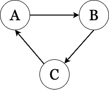
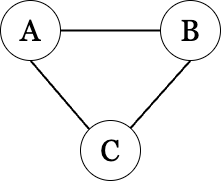
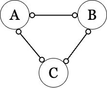
```

The graph produced by the PC algorithm is a *CPDAG* (completed partially directed acyclic graph), where directed edges ($A$ → $B$) indicate that $A$ is a direct cause (parent) of $B$. Unlike FCI and CCI, the CPDAG does not include circle symbols. Instead, when the PC algorithm cannot determine the direction of causality, it represents this uncertainty with bidirectional arrows. 
While the PC algorithm serves as a useful reference, its strict assumptions — acyclicity and the absence of latent confounders—limit its applicability in more complex scenarios. For this reason, our primary focus remains on the results obtained from FCI and CCI, with all PC algorithm results provided in @sec-pc for completeness. 


## Precariousness Domains Based on Elsenburg et al. (2025)

We began from the domain definitions and candidate indicators in @elsenburg2025clustering, listed below. Before graph learning, we screened candidates for measurement quality and within-domain coherence among precariousness indicators (e.g., missingness, variability, and inter-item correlations). Indicators that were largely disconnected from the remaining precariousness indicators were not carried forward, because they primarily entered as isolated variables while substantially increasing computational cost.


1.  EMPLOYMENT PRECARIOUSNESS

-   `H1_Arbeidsparticipatie`: Working status
-   `H1_WerkSit`: Which work situation most applies to you?
-   `H1_RecentErv8`: Experiences past 12 months: h. You were sacked from your job or became unemployed (*reverse*)

2.  FINANCIAL PRECARIOUSNESS

-   `H1_InkHhMoeite`: During the past year, did you have problems managing your household income?
-   `H1_RecentErv9`: Experiences past 12 months: i. You had a major financial crisis (*reverse*)

3.  HOUSING PRECARIOUSNESS

-   `veilig_2012`: Score safety (veiligheid) in 2012 (*reverse*)
-   `vrz_2012`: Score level of resources (niveau voorzieningen) in 2012 (*reverse*)
-   `P_HUURWON`: Percentage Huurwoningen

4.  CULTURAL PRECARIOUSNESS

-   `H1_Discr_sumscore`: Perceived discrimination: sum score of 9 items (range 9-45)
-   `H1_SBSQ_meanscore`: Health literacy: SBSQ meanscore (range 1-5) (*reverse*)
-   `A_BED_RU`: Aantal bedrijfsvestigingen; cultuur, recreatie, overige diensten (*reverse*)

5.  SOCIAL PRECARIOUSNESS

-   `H1_RecentErv5`: Experiences past 12 months: e. Your steady relationship ended (*reverse*)
-   `H1_RecentErv6`: Experiences past 12 months: f. A long-term friendship with a good friend or family member was broken off (*reverse*)
-   `H1_RecentErv7`: Experiences past 12 months: g. You had a serious problem with a good friend or family member, or neighbour (*reverse*)
-   `H1_SSQT`: SSQT (frequency of social contact): sum score of 5 items (range 5-20) (*reverse*)
-   `H1_SSQSa`: SSQS (adequacy of social contact): sum score of 5 items, category 3 and 4 not combined (range 5-20) (*reverse*)

```{r, echo=FALSE, fig.align='center', fig.width=15}
# check correlation
#cor(df) |> round(2)

# visualize corr
col <- colorRampPalette(c("#BB4444", "#EE9988", "#FFFFFF", "#77AADD", "#4477AA"))
corrplot(cor(scaled_data[,c(1:16, 26, 27)]), method="color", col=col(200),
         type="upper", order="hclust",
         addCoef.col = "black", # Add coefficient of correlation
         tl.col="black", number.cex=0.50, tl.srt=45,tl.cex=0.7, #Text label color and rotation
         # hide correlation coefficient on the principal diagonal
         diag=FALSE
         )
```

-   **High** Correlations: `emp_stat` (employment status) and `work_sit` (work situation) have a strong positive correlation of 0.82. This suggests that individuals with higher employment status tend to have more secure or favorable work situations. `soc_freq` (social contact frequency) shows a strong positive correlation with `soc_adq` (social adequacy) at 0.61. This indicates that individuals with more frequent social contact also tend to have higher perceived adequacy of social interactions.

-   **Moderate** Correlations: `nb_safe` (neighborhood safety) and `nb_res` (resources) have a moderate positive correlation of 0.39, suggesting that areas with higher safety also have better resources. `hea_lit` (health literacy) has moderate correlations with `emp_stat` (0.26) and `work_sit` (0.25), which could mean that higher health literacy is associated with better employment situations. `frd_brk12` (friendship breakups) and `conf12` (conflicts) have a notable correlation of 0.43, indicating a relationship between having conflicts and friendship losses.

-   **Low to Moderate** Correlations in Financial Precariousness: `inc_dif` (income difficulties) has a moderate correlation with `fincri12` (financial crisis) at 0.49. This aligns with the expected relationship, where individuals who experience general income difficulties are more likely to report financial crises.

-   **Low** Correlations (0.1 - 0.2): Many variables, such as `discrim` (discrimination), `unemp12` (unemployment experience), and `rel_end12` (relationship end), have low correlations with other variables, suggesting relatively independent relationships in the context of this dataset.

### Exploratory Factor Analysis (EFA)

```{r, echo=FALSE, fig.align='center', fig.height=5, out.width="55%", message=FALSE, results='hide'}
# precarious factors
df <- scaled_data[,1:16]

# check suggested number of factors
pl <- fa.parallel(df, fa = "fa", n.iter = 100, show.legend = FALSE)
# run EFA
efa_result <- fa(df, nfactors = 5, rotate = "promax") # oblique rotation
#print(efa_result)
```

```{r, echo=FALSE, fig.align='center', out.width="70%"}
# Create a data frame from the pattern matrix
loadings <- data.frame(
  Variable = c("emp_stat", "work_sit", "unemp12", "inc_dif", "fincri12", "nb_safe", "nb_res", "nb_rent",
               "discrim", "hea_lit", "cul_rec", "rel_end12", "frd_brk12", "conf12", "soc_freq", "soc_adq"),
  MR1 = c(0.98, 0.97, 0.17, 0.21, 0.11, -0.08, 0.02, -0.03, -0.07, 0.27, -0.03, -0.04, -0.09, -0.08, -0.02, -0.03),
  MR2 = c(-0.06, -0.08, -0.03, 0.09, 0.05, -0.08, -0.05, -0.06, 0.17, 0.08, -0.08, -0.04, -0.04, 0.00, 1.00, 0.77),
  MR3 = c(-0.01, -0.06, 0.26, 0.28, 0.47, -0.05, -0.04, -0.02, 0.20, -0.10, -0.05, 0.36, 0.63, 0.56, -0.14, -0.01),
  MR4 = c(-0.02, -0.03, -0.04, 0.06, 0.03, -0.02, 0.71, -0.09, 0.13, 0.04, 0.61, -0.03, -0.01, -0.02, -0.04, -0.12),
  MR5 = c(-0.14, -0.11, -0.03, 0.16, 0.09, 0.61, -0.21, 0.54, 0.10, 0.15, 0.04, -0.01, -0.06, -0.06, -0.10, -0.13)
)

# Convert to long format
loadings_long <- loadings %>%
  pivot_longer(cols = starts_with("MR"), names_to = "Factor", values_to = "Loading")

# Plot heatmap
ggplot(loadings_long, aes(x = Factor, y = Variable, fill = Loading)) +
  geom_tile(color = "white") +
  scale_fill_gradient2(low = "red", mid = "white", high = "blue", midpoint = 0, limits = c(-1, 1)) +
  theme_minimal() +
  labs(title = "Factor Loadings Heatmap", x = "", y = "")
```

#### Factor Loadings (Pattern Matrix)

-   **MR1**: High loadings on `emp_stat` and `work_sit` suggest this factor captures *employment* precariousness.
-   **MR2**: Strong loadings on `soc_freq` and `soc_adq` indicate *social* precariousness.
-   **MR3**: Key items like `frd_brk12`, `conf12`, and `fincri12`, suggest recent *stressful events*.
-   **MR4**: High loadings on `nb_res` and `cul_rec` may reflect *community resources* precariousness.
-   **MR5**: Variables `nb_safe` and `nb_rent` with high loadings indicate *housing* precariousness.

#### Variance Explained

The factors cumulatively explain **38%** of the variance, with MR1 being the most influential factor. Each factor contributes a smaller proportion to the total variance (MR1 at 12%, MR2 at 9%, etc.).

#### Factor Intercorrelations

Factors are moderately correlated, especially between *MR1 and MR5*, and *MR2 and MR3*. This indicates that while distinct, these factors are related—reasonable in a complex socio-economic context.

#### Model Fit Statistics

RMSEA (0.071) suggests an acceptable fit. Tucker Lewis Index (0.802) suggests moderate reliability for the model.

#### Summary

The 5-factor model appears interpretable and captures distinct dimensions of precariousness: *employment, social, stressors, community resources, and housing precariousness*. Although the overall fit and explained variance could be stronger, these factors offer insights into the underlying structure of the data, highlighting key areas of precariousness.

### PCA

```{r, echo=FALSE, fig.align='center', out.width="70%"}
# run PCA
res.pca <- prcomp(df, scale = TRUE)
# print(res.pca)
#summary(res.pca)

# Visualize eigenvalues (scree plot)
fviz_eig(res.pca, addlabels = TRUE)
#
# fviz_pca_var(res.pca,
#              col.var = "contrib", # Color by contributions to the PC
#              gradient.cols = c("#00AFBB", "#E7B800", "#FC4E07"),
#              repel = TRUE     # Avoid text overlapping
#              )
```

-   Component Retention: The scree plot shows a clear "elbow" after the first component. This steep drop suggests that most variance is explained by the first component. After Dimension 5, the percentage of explained variance decreases slightly more gradually, indicating diminishing returns for adding more components. If we need to choose multiple components, retaining the first 5 components seems reasonable, as they capture most of the variance (cumulatively explaining about 54.7% of the total variance).

```{r, echo=FALSE, fig.align='center', fig.height=4.5, fig.width = 8}
# Results for Variables
res.var <- get_pca_var(res.pca)
# res.var$coord |> round(2)         # Coordinates
# res.var$contrib |> round(2)        # Contributions to the PCs
# res.var$cos2           # Quality of representation

# corrplot(res.var$cos2, is.corr=FALSE)

res.var$contrib |> as.data.frame() |> dplyr::select(1:5) |>
  tibble::rownames_to_column(var = "var") |> # adds a column for rownames
    pivot_longer(cols = starts_with("Dim"),
               names_to = "Dimension",
               values_to = "Contribution") |>
# Plot with facet_wrap to show each dimension in a separate facet
ggplot(aes(x = reorder(var, -Contribution), y = Contribution, fill = Contribution)) +
  geom_bar(stat = "identity", show.legend = FALSE) +
  facet_wrap(~ Dimension, scales="free_y") +
  coord_flip() +
  labs(title = "Contribution of Variables to 5 Principal Components",
       x = "", y = "Contribution (%)") +
  scale_fill_gradient(low = "lightblue", high = "blue") +
  theme_minimal() +
  theme(strip.text = element_text(face = "bold"))
```

#### Explained variance (contributions) of variables

It shows the importance of variables within each component.

-   **Dim1**: High contributions are observed from `emp_stat`, `work_sit`, `inc_dif`, and `fincri12`, suggesting that this dimension captures aspects of *employment and financial* security.

-   **Dim2**: While `emp_stat` and `work_sit` overlap with Dim1, the strong contributions from `frd_brk12` and `rel_end12` indicate that this dimension captures a focus on *recent relationship stressors*.

-   **Dim3**: `cul_rec`, `nb_res` have the highest contributions, indicating this dimension likely represents *community and cultural* factors.

-   **Dim4**: `soc_freq` and `soc_adq` stand out in this dimension, suggesting an emphasis on *social* precariousness.

-   **Dim5**: `nb_safe` and `nb_rent` are the top contributors, pointing to *housing* security as key themes in this component.

#### Cos² Values

Cos² (squared cosine) values, or the quality of representation, show how well each variable is represented by each dimension. where higher cos² values (closer to 1) indicate better representation of a variable by a component.

```{r, echo=FALSE, fig.align='center', out.width="70%"}
res.var$cos2 |> as.data.frame() |> dplyr::select(1:5) %>%
  mutate(var = rownames(.)) |>
  pivot_longer(!var, names_to = "dim", values_to = "cos2") |>
  ggplot(aes(x = dim, y = var, fill = cos2)) +
  geom_tile(color = "white") +
  scale_fill_gradient2(low = "red", mid = "white", high = "blue") +
  labs(title = "Cos2 of Variables on Each Component (1-5)", fill = "Cos2", x = "", y = "") +
  theme_minimal()
```

-   **Dim.1**: Variables `emp_stat`, `work_sit`, `inc_dif`, and `fincri12` show high cos² values, meaning that PC1 primarily captures variations in employment and financial difficulties. This component could represent *employment & finance* precariousness.

-   **Dim.2**: Variables `work_sit`, `emp_stat`, `frd_brk12`, and `conf12` are well-represented in this component, suggesting PC2 captures aspects of *recent relationship stressors*.

-   **Dim.3**: Variables `nb_res` and `cul_rec` load strongly on PC3. This may represent community or cultural resources, indicating that this component is associated with *neighborhood resources*.

-   **Dim.4**: This component has high cos² values for `nb_res`, `cul_rec`, `soc_freq`, and `soc_adq.` While `nb_res` and `cul_rec` are also prominent in PC3, PC4 uniquely captures nuanced differentiation in *social* precariousness.

-   **Dim.5**: `nb_safe` and `nb_rent` are well-represented by PC5. This component might capture *housing* precariousness.

### ICA

```{r, echo=FALSE,  fig.align='center', out.width="70%"}
# Load the library
library(fastICA)
# set the seed
set.seed(1)

# Set the number of components you want to extract
n_components <- 5

# Run ICA
ica_model <- fastICA(df,
  n.comp = n_components, alg.typ = "parallel",
  fun = "exp", method = "C", maxit = 5000
)
# glimpse(ica_model)

weight_matrix <- data.frame(t(ica_model$A))
names(weight_matrix) <- stringr::str_glue("IC{seq(weight_matrix)}")

# dist_matrix <- dist(as.matrix(weight_matrix))
# clust <- hclust(dist_matrix)
# plot(clust)

weight_matrix |>
  mutate(var = colnames(df)) |>
  pivot_longer(
    cols = starts_with("IC"),
    names_to = "IC", values_to = "loading"
  ) |>
  ggplot(aes(x = IC, y = var, fill = loading)) +
  geom_tile(color = "white") +
  scale_fill_gradient2(low = "red", mid = "white", high = "blue", midpoint = 0, limits = c(-1, 1)) +
  labs(x="", y="") +
  theme_minimal()
```

#### Dominant Variables per Component:

For each Independent Component (IC), we can identify variables with *high absolute* values in each column. These values indicate that the IC captures a strong, independent signal associated with these variables.

-   **IC1**: `soc_freq` and `soc_adq` have strong negative loadings on this component, indicating that this component might represent *social* precariousness.

-   **IC2**: `frd_brk12`, `conf12`, `rel_end12`, `fincri12` and `unemp12` have the most substantial loadings on this component, all with negative signs. This might point to a *recent relational or social stressor* component.

-   **IC3**: `nb_res` and `cul_rec` show notable negative loadings, pointing to a focus on *community resource* precariousness.

-   **IC4**: High loadings for `nb_safe`, `nb_rent`, `nb_res`, `cul_rec`, and `discrim` suggest a theme of *housing and community-based* precariousness, reflecting both safety and social challenges within the neighborhood context.

-   **IC5**: `emp_stat` and `work_sit` both have strong negative loadings on this component, suggesting it captures *employment* precariousness.

### Hierarchical clustering

#### Using Euclidean distance

-   Ward.D's method: Minimizes the variance within clusters, producing more compact and spherical clusters.
-   Single linkage: Groups clusters based on the minimum distance between points.
-   Complete linkage: Groups clusters based on the maximum distance between points.
-   Average linkage: Uses the average distance between all pairs of points in the two clusters.

```{r, warning=FALSE, message=FALSE, fig.height=7, echo=FALSE, fig.align='center'}
#| layout-ncol: 2
library(dendextend)  # For coloring the clusters
library(ggdendro)


# Compute the distance matrix between variables
distance_matrix <- dist(t(df))

# wardD
hc_ward <- hclust(distance_matrix, method = "ward.D")
# dend <- as.dendrogram(hc)
# dend_colored <- dendextend::color_branches(dend, k = 5)  # Specify the number of clusters
plot(hc_ward, main = "ward.D")
rect.hclust(hc_ward, k = 5, border = 2:6)

# Avg
hc_avg <- hclust(distance_matrix, method = "average")
# dend <- as.dendrogram(hc)
# dend_colored <- dendextend::color_branches(dend, k = 5)
plot(hc_avg, main = "average")
rect.hclust(hc_avg, k = 5, border = 2:6)

hc_comp <- hclust(distance_matrix, method = "complete")
# dend <- as.dendrogram(hc)
# dend_colored <- dendextend::color_branches(dend, k = 5)
plot(hc_comp, main = "complete")
rect.hclust(hc_comp, k = 5, border = 2:6)

hc_sing <- hclust(distance_matrix, method = "single")
# dend <- as.dendrogram(hc)
# dend_colored <- dendextend::color_branches(dend, k = 5)  # Specify the number of clusters
plot(hc_sing, main = "single")
rect.hclust(hc_sing, k = 5, border = 2:6)
```

##### Consistent Groupings (Across All or Most Methods)

-   `emp_stat` and `work_sit`: This pair consistently clusters together across all linkage methods, suggesting that they are closely related variables, likely capturing a similar aspect of the data (possibly employment status or employment-related information).

-   `nb_safe`, `nb_res`, and `nb_rent`: These variables are often grouped closely in several methods (especially Ward.D, average, and complete linkage). This suggests a similarity or common theme among them, potentially related to neighborhood or housing precariousness.

-   `soc_freq` and `soc_adq`: These two variables frequently cluster together, indicating they likely measure aspects of social frequency and adequacy in similar ways. They appear together in Ward.D, average, and complete linkage.

-   `frd_brk12` and `conf12`: These variables are often clustered closely (though they sometimes join with other variables like rel_end12), suggesting they may capture aspects of relationship or social conflict. This pair appears in close proximity, especially in average and Ward.D.

##### Inconsistent Groupings (Variability Across Methods)

-   `hea_lit`: This variable shows inconsistent clustering across methods. In Ward.D, it joins with `fincri12`, while in other methods, it’s often more isolated or grouped with variables that do not appear similar. This may suggest that `hea_lit` does not strongly correlate with other variables, or it has multidimensional aspects affecting its grouping across methods.

-   `discrim`: This variable also shows variable groupings. In Ward.D, it is grouped with `hea_lit`, while in other methods (e.g., complete and single linkage), it clusters differently, sometimes on its own. This variability may indicate that `discrim` has weaker associations with the main clusters in the data or overlaps partially with multiple clusters.

-   Social and Financial Variables (`inc_dif`, `fincri12`, `unemp12`): These variables appear together in some methods (e.g., Ward.D clusters `fincri12` and `inc_dif`), but in others, they are spread out. This inconsistency suggests that social and financial variables may not have strong or consistent ties across different methods, perhaps due to capturing different aspects of precariousness.

##### Summary

The consistent clusters are likely capturing distinct thematic dimensions of the data (e.g., employment, housing, social contact), while the inconsistent variables may reflect multifaceted or weakly correlated attributes that do not fit neatly into one cluster.

#### Using Mutual Information

Using mutual information (MI) as a basis for hierarchical clustering differs from using traditional distance measures (like Euclidean distance) in a few key ways.

```{r echo=FALSE, fig.align='center', fig.height=6, out.width="60%"}
library(infotheo)  # for mutual information functions

# Calculate pairwise mutual information
mi_matrix <- matrix(NA, ncol = ncol(df), nrow = ncol(df))
colnames(mi_matrix) <- rownames(mi_matrix) <- colnames(df)

for (i in 1:ncol(df)) {
  for (j in i:ncol(df)) {
    # Calculate mutual information between pairs of variables
    mi_matrix[i, j] <- mutinformation(discretize(df[, i]), discretize(df[, j]))
    mi_matrix[j, i] <- mi_matrix[i, j]  # symmetric
  }
}

# Normalize mutual information matrix
max_mi <- max(mi_matrix, na.rm = TRUE)
mi_distance <- 1 - (mi_matrix / max_mi)

# Convert to distance object
dist_matrix_mi <- as.dist(mi_distance)

# Hierarchical clustering on MI-based distance
hc_mi <- hclust(dist_matrix_mi, method = "ward.D2")

# Plot the dendrogram
plot(hc_mi, main = "Hierarchical Clustering (Mutual Information Distance)", xlab = "", sub = "")
rect.hclust(hc_mi, k = 5, border = 2:6)

```

##### Comparison to Euclidean Distance Clustering

-   **Housing and Community** Cluster: The variables `nb_safe`, `nb_res`, `nb_rent`, and `cul_rec` cluster together, indicating a strong association among housing-related and community-based factors. This suggests a shared theme of housing or community precariousness. This grouping is also observed in the Euclidean-based clustering, but it appears more tightly connected here, potentially due to the non-linear relationships highlighted by mutual information.

-   **Employment and Social Support** Cluster: `emp_stat` and `work_sit` form a cluster, linking employment status and work situation together as they did in Euclidean-based clustering. These remain closely associated regardless of the distance metric used. `soc_freq` and `soc_adq`, related to social contact frequency and adequacy, cluster nearby, indicating they have a stronger non-linear relationship with employment variables. This is a subtle difference as Euclidean distance might not capture this association as effectively.

-   **Financial Stressor** Cluster: `inc_dif` and `fincri12`, representing income difficulties and recent financial crises, consistently cluster together in both approaches, showing a strong association, likely linear. However, mutual information-based clustering links these financial stressors with social support variables, suggesting that financial challenges may have complex dependencies with social support in this dataset.

-   **Relational Stressor** Cluster: `frd_brk12`, `conf12`, `discrim`, `hea_lit`, `unemp12`, and `rel_end12` form a *looser* cluster focused on social and relational stressors (e.g., friendship breakup, conflicts, and discrimination). Compared to Euclidean clustering, `discrim` and `hea_lit` (health literacy) appear closer to relational stressors here, indicating that non-linear relationships might play a larger role in linking these variables.

##### Summary

In conclusion, mutual information-based clustering provides an alternative perspective that can reveal more intricate associations between variables, especially for those with non-linear relationships. Compared to Euclidean clustering, it shows a similar high-level structure but emphasizes nuanced connections between variables, particularly around social support, employment, and financial stress.

### Conclusions on Precariousness factors

Based on the consistent findings across multiple analyses, we excluded the variables `discrim`, `hea_lit`, `unemp12`, and `rel_end12`, because they did not map cleanly onto any precariousness domain and showed little association with the remaining precariousness indicators (see the correlation table above). Retaining them would mainly add weakly connected or isolated variables to the subsequent graph learning step and materially increase computational cost, with limited gain in interpretability. Therefore, we propose retaining the following key precariousness factors:


-   Employment Precariousness: `emp_stat`, `work_sit`
-   Social Precariousness: `soc_freq`, `soc_adq`
-   Housing Precariousness: `nb_safe`, `nb_res`, `nb_rent`, `cul_rec`
-   Recent Relational Stressors: `frd_brk12`, `conf12`
-   Recent Financial Stressors: `fincri12`, `inc_dif`

We construct each precariousness factor by calculating the mean value of the combined variables. Below, we present the updated correlation table for the newly composed factors, along with the corresponding distributions of all variables to be used in the causal discovery analysis.

```{r, echo=FALSE, fig.align='center'}
clust_data <- scaled_data |>
  mutate(
    P.emp = rowMeans(cbind(emp_stat, work_sit)),
    P.soc = rowMeans(cbind(soc_freq, soc_adq)),
    P.hou = rowMeans(cbind(nb_safe, nb_res, nb_rent, cul_rec)),
    S.rel = rowMeans(cbind(frd_brk12, conf12)),
    S.fin = rowMeans(cbind(fincri12, inc_dif))
  ) |>
  dplyr::select(17:33, -c(age, ethn)) |>
  as.data.frame()

# skimr::skim(clust_data)

# visualize corr
corrplot(cor(clust_data), method="color", col=col(200),
         type="upper", order="hclust",
         addCoef.col = "black", # Add coefficient of correlation
         tl.col="black", number.cex=0.50, tl.srt=45,tl.cex=0.7,
         diag=FALSE
         )


```

```{r echo=FALSE, fig.align='center', fig.height=4.5, fig.width=8}
# Reshape the data to long format
clust_data_long <- clust_data %>%
  pivot_longer(cols = everything(), names_to = "variable", values_to = "value") 
  

# Plot distributions with density lines
ggplot(clust_data_long, aes(x = value)) +
  geom_histogram(aes(y = after_stat(density)), fill = "lightblue", color = "white", bins = 15) +  # Use density for histogram
  geom_density(adjust=2, linewidth=0.3, color = "gray", alpha = 0.5) +  # Add density line in red
  facet_wrap(~ variable, scales = "free") +
  labs(title = "Distribution of All Variables with Density Overlay", x = "", y = "") +
  theme_minimal()
```


## Results from CCI algorithm {#sec-cci}

```{r}
#| layout-ncol: 2
#| label: fig-sum-cci
#| fig-cap: "***Causal pathways between precariousness factors and overall depression severity, estimated with CCI.***  **(a)** Aggregated CCI graph (MAAG) summarizing the most frequent edge types across bootstraps. Compared to FCI, the CCI algorithm produces more ambiguous orientations, with fewer clear directional arrows.  **(b)** Proportion matrix showing edge-type frequencies across bootstraps. More undirected and bidirectional edges appear relative to FCI, reflecting increased uncertainty and potential latent confounding in the estimated structure."
#| fig-subcap: 
#|   - "CCI MAAG"
#|   - "Proportion matrix"
#| fig-align: center
#| out-width: 100%

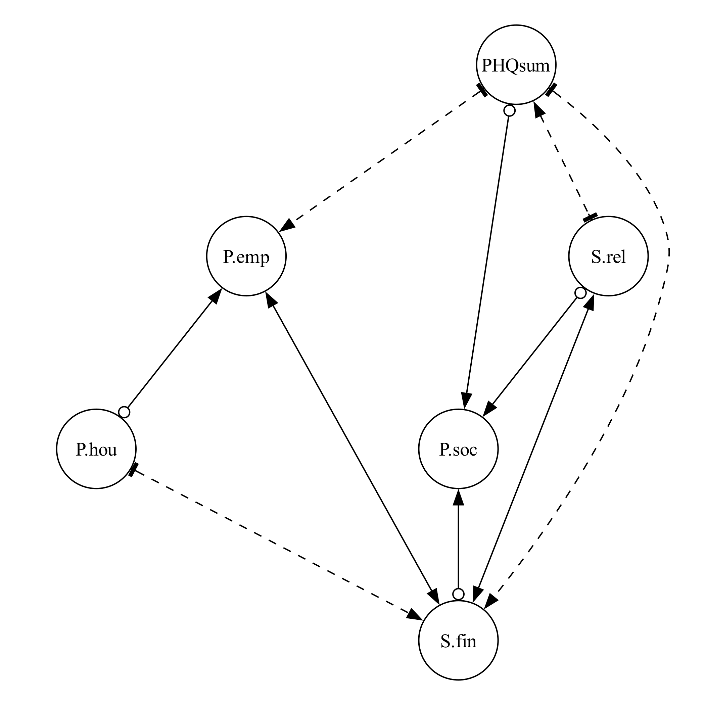
knitr::include_graphics("img/depsum_mat_cci.pdf")

```


```{r}
#| label: fig-sym-cci
#| layout-nrow: 2
#| fig-cap: "***Causal pathways linking individual depressive symptoms and precariousness factors, estimated with CCI.***  **(a)** Aggregated CCI graph (MAAG) summarizing symptom–precariousness relationships. CCI yields a denser network with more bidirectional edges, consistent with stronger involvement of latent confounders.  **(b)** Proportion matrix showing edge-type frequencies across bootstraps. Compared to FCI, CCI favors arrowheads more often, resulting in more bidirectional or confounded edges between symptoms and precariousness factors."
#| fig-subcap: 
#|   - "CCI MAAG"
#|   - "Proportion matrix"
#| fig-align: center
#| out-width: 60%

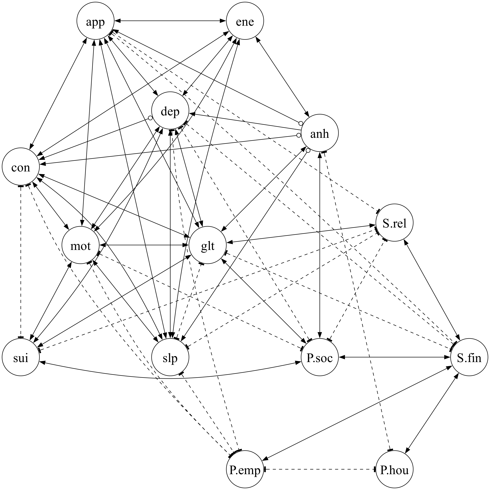
knitr::include_graphics("img/symptom_mat_cci.pdf")

```


\newgeometry{top=10mm, bottom=20mm, left=40mm, right=40mm}

```{r}
#| layout-nrow: 2
#| label: fig-presum-cci
#| fig-cap: "***Causal pathways between overall precariousness and individual depressive symptoms, estimated with CCI.***  **(a)** Aggregated CCI graph (MAAG) summarizing the most frequent edge types across bootstraps. CCI suggests stronger interconnections among symptoms, with more bidirectional links than in the FCI graph. Depressed mood (*dep*) appears as a distinct exception, receiving influence from many other symptoms.  **(b)** Proportion matrix showing edge-type frequencies across bootstraps. CCI highlights a potential feedback loop between *dep* and overall precariousness, represented by a tail–tail edge, consistent with a reinforcing cycle. Compared to FCI, the CCI results emphasize latent confounding and cyclic dependencies."
#| fig-subcap: 
#|   - "CCI MAAG"
#|   - "Proportion matrix"
#| fig-align: center
#| out-width: 60%


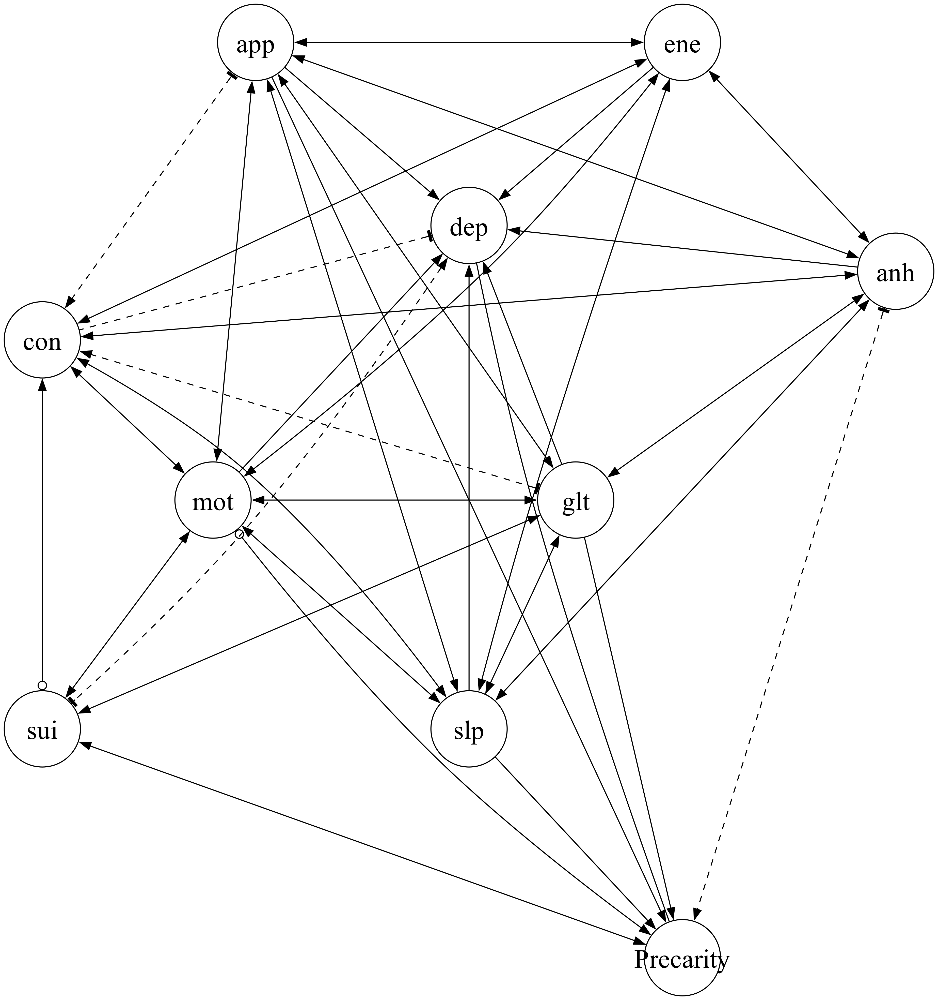
knitr::include_graphics("img/presum_mat_cci.pdf")
```


\restoregeometry


## Results from PC algorithm {#sec-pc}

```{r}
#| layout-ncol: 2
#| label: fig-pc_sum
#| fig-cap: "***Causal pathways between precariousness factors and overall depression severity, estimated with PC.*** **(a)** Graph using both Gaussian CI and RCoT tests. **(b)** Graph using only RCoT. PC produces a CPDAG, which excludes cycles and represents uncertainty with bidirectional edges. Gaussian CI yields denser graphs than RCoT."
#| fig-subcap:
#|   - "Using both GaussianCI and RCoT"
#|   - "Using only RCoT"
#| fig-align: center
#| out-width: 100%

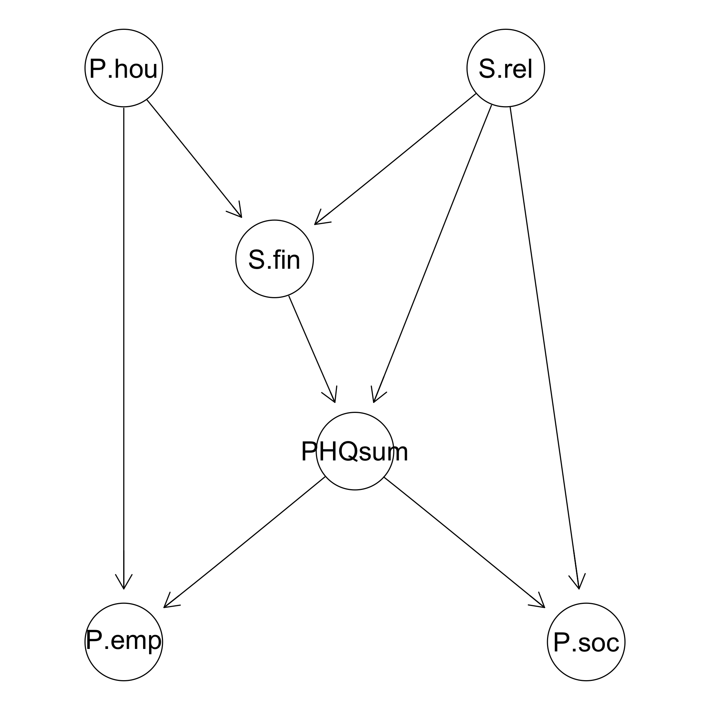
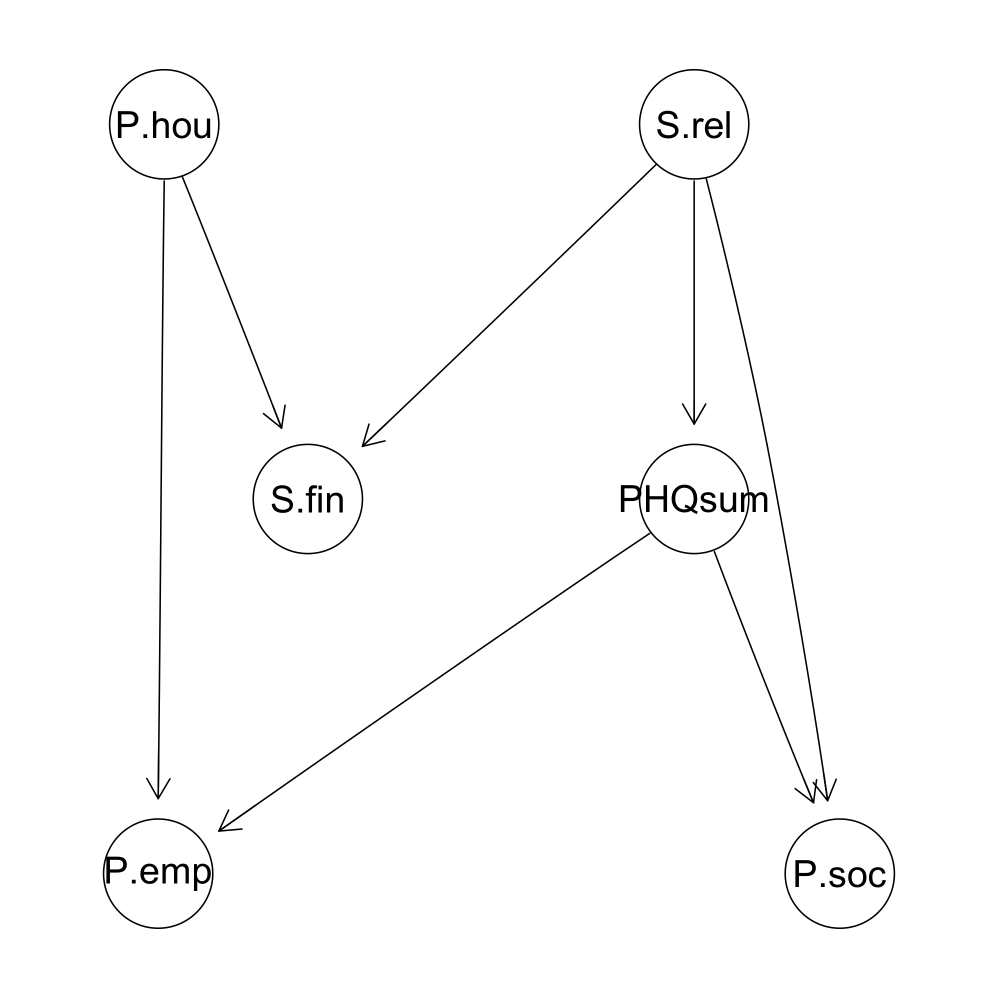
```


```{r}
#| label: fig-pc_sym
#| fig-cap: "***Causal pathways linking individual depressive symptoms and precariousness factors, estimated with PC.*** The CPDAG representation is denser than FCI or CCI outputs. Gaussian CI again produces more edges than RCoT (dashed navy edges mark those unique to Gaussian)."
#| fig-align: center
#| out-width: 60%

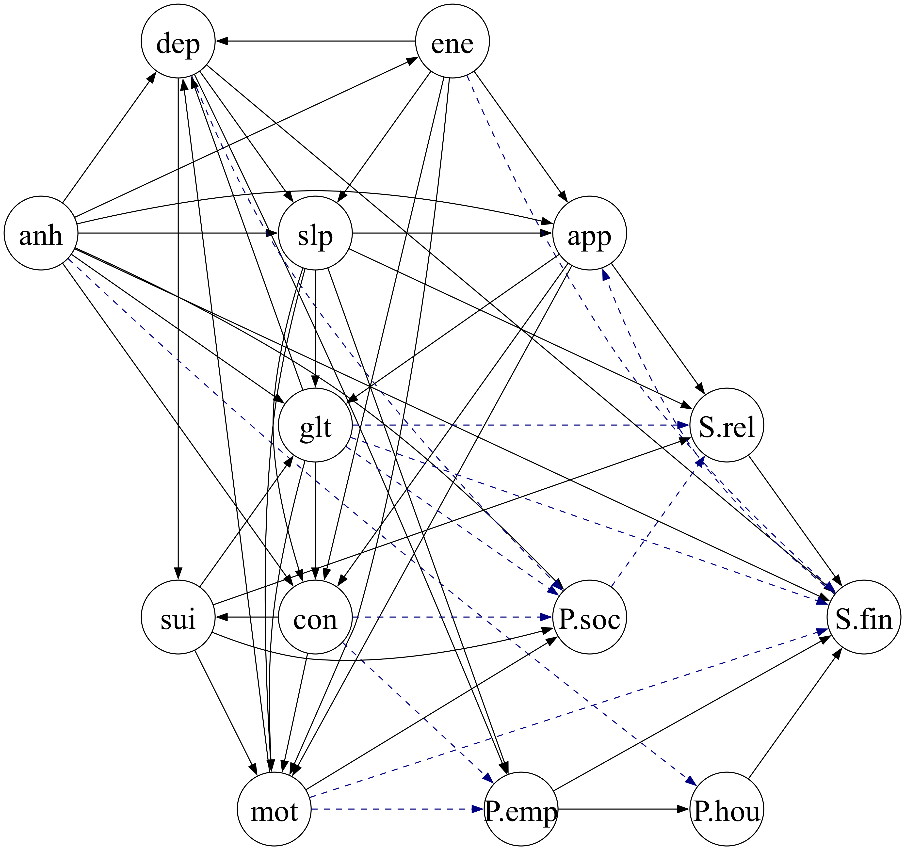
```

```{r}
#| label: fig-pc_presum
#| fig-cap: "***Causal pathways between overall precariousness and individual depressive symptoms, estimated with PC.***  As with the symptom-level graph, PC recovers dense structures under Gaussian CI but sparser ones under RCoT (dashed navy edges mark those unique to Gaussian)."
#| fig-align: center
#| out-width: 60%

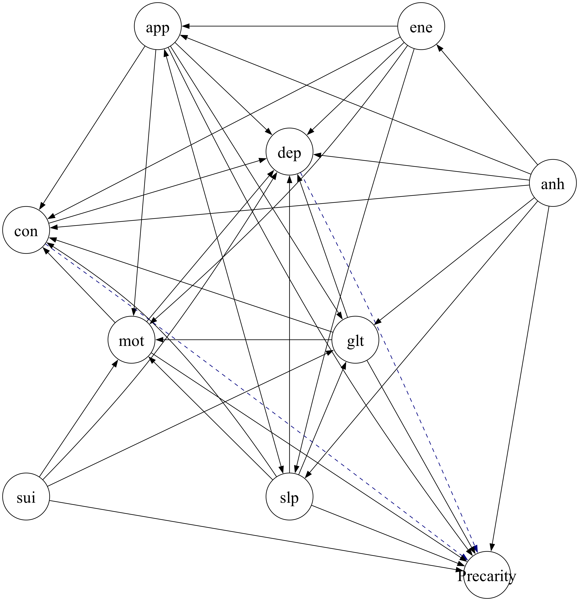
```

\clearpage


## Randomized Conditional Independence / Correlation Test (RCIT & RCoT) {#sec-rcot}

RCIT (Randomized Conditional Independence Test) and RCoT (Randomized conditional Correlation Test) are advanced methods for scalable conditional independence (CI) testing, offering computational efficiency while maintaining the accuracy of kernel-based approaches. These methods evaluate conditional independence between two variables $X$ and $Y$ given a third variable $Z$ while addressing computational challenges inherent in kernel-based CI tests.  In this section, we provide a high-level overview of RCIT and RCoT based on [@strobl2019approximate].

### Kernel-Based Conditional Independence Testing

Traditional kernel-based CI tests, such as the Kernel Conditional Independence Test (KCIT), compute dependencies using the Hilbert-Schmidt Independence Criterion (HSIC) in reproducing kernel Hilbert spaces (RKHS) [@zhang2012kernel]. KCIT uses the following hypothesis framework:
$$
H_0: X \perp\!\!\!\perp Y \,|\, Z, \quad H_1: X \not\!\perp\!\!\!\perp Y \,|\, Z.
$$
The core quantity in KCIT is the partial cross-covariance operator:
$$
\Sigma_{XY \cdot Z} = \Sigma_{XY} - \Sigma_{XZ} \Sigma_{ZZ}^{-1} \Sigma_{ZY},
$$
where $\Sigma_{XY}$ represents the cross-covariance operator between $X$ and $Y$, and $\Sigma_{XZ} \Sigma_{ZZ}^{-1} \Sigma_{ZY}$ removes the dependence mediated by $Z$.

The squared Hilbert-Schmidt (HS) norm of $\Sigma_{XY \cdot Z}$ serves as the test statistic:
$$
\|\Sigma_{XY \cdot Z}\|^2_{HS} = 0 \quad \text{if and only if} \quad X \perp\!\!\!\perp Y \,|\, Z.
$$

KCIT estimates residual dependencies using kernel ridge regression:
$$
f^*(z) = K_Z (K_Z + \lambda I)^{-1} f(x),
$$
where $K_Z$ is the kernel matrix for $Z$, $f(x)$ is the kernel feature map for $X$, and $\lambda$ is the ridge regularization parameter. The residual function for $X$ is:
$$
f_\text{res}(x) = f(x) - f^*(z) = R_Z f(x),
$$
with:
$$
R_Z = I - K_Z (K_Z + \lambda I)^{-1}.
$$
The kernel matrix for residualized $X$ is:
$$
K_{X \cdot Z} = R_Z K_X R_Z,
$$
and similarly for $Y$, $K_{Y \cdot Z} = R_Z K_Y R_Z$.

The test statistic is computed as:
$$
T_{XY \cdot Z} = \frac{1}{n^2} \text{tr}(K_{X \cdot Z} K_{Y \cdot Z}),
$$
which estimates the Hilbert-Schmidt (HS) norm of the partial cross-covariance operator. To ensure convergence, KCIT scales the statistic by $n$:
$$
S_K = n T_{XY \cdot Z}.
$$
The null hypothesis $H_0$ is rejected if $S_K$ exceeds a threshold determined by permutation or moment-matching-based null distribution [@lindsay2000moment].


### Random Fourier Features (RFFs)

Kernel-based methods like KCIT face scalability issues, as they involve operations on $n \times n$ kernel matrices, which scale quadratically with the sample size $n$. RCIT and RCoT overcome this bottleneck using *Random Fourier Features (RFFs)* to approximate kernel operations efficiently.

#### Bochner’s Theorem
Bochner’s theorem provides the foundation for RFFs, stating that any continuous shift-invariant kernel $k(x, y)$ can be expressed as:
$$
k(x, y) = \int_{\mathbb{R}^p} e^{i \omega^\top (x - y)} \, dP_\omega,
$$
where $P_\omega$ is the spectral distribution of the kernel. For the widely used RBF kernel:
$$
k(x, y) = \exp\left(-\frac{\|x - y\|^2}{2\sigma^2}\right),
$$
$P_\omega$ follows a Gaussian distribution: $\omega \sim \mathcal{N}(0, \sigma^2 I)$.

#### RFF Approximation
Using Monte Carlo sampling, the kernel function is approximated as:
$$
k(x, y) \approx \phi(x)^\top \phi(y),
$$
where $\phi(x)$ is the random Fourier feature mapping:
$$
\phi(x) = \sqrt{\frac{2}{D}} \cos(W^\top x + b),
$$
with $W \sim \mathcal{N}(0, \sigma^2 I)$ and $b \sim \text{Uniform}(0, 2\pi)$. Here, $D$ is the number of Fourier features, which balances computational efficiency and approximation accuracy.

### Differences Between RCIT and RCoT

RCIT and RCoT differ in their test statistics, computational efficiency, and practical performance, which makes them suited for different scenarios in causal discovery. RCIT evaluates the Hilbert-Schmidt norm of the full partial cross-covariance operator, providing a general test for conditional independence but at a higher computational cost. RCoT simplifies the process by using the Frobenius norm of a finite-dimensional residualized cross-covariance matrix, significantly reducing complexity and improving scalability.

These distinctions are particularly important for large-scale datasets, where RCoT's computational efficiency makes it a practical choice for high-dimensional causal discovery tasks.
In our study, we use RCoT primarily for computational scalability at the HELIUS sample size and as part of our sensitivity analyses; it does not remove the fundamental loss of statistical power and increased estimation difficulty that typically occurs as the conditioning set $|Z|$ grows.

#### RCIT: Randomized Conditional Independence Test

RCIT tests full conditional independence by examining the squared Hilbert-Schmidt (HS) norm of the partial cross-covariance operator $\Sigma_{XY \cdot Z}$:
$$
S_K = n T_{XY \cdot Z} = \frac{1}{n} \text{tr}(K_{X \cdot Z} K_{Y \cdot Z}),
$$
where $T_{XY \cdot Z}$ is an empirical estimate of $\|\Sigma_{XY \cdot Z}\|^2_{HS}$. The null and alternative hypotheses are:
$$
H_0: \|\Sigma_{XY \cdot Z}\|^2_{HS} = 0, \quad H_1: \|\Sigma_{XY \cdot Z}\|^2_{HS} > 0.
$$

RCIT is a general test for conditional independence but becomes computationally demanding as the size of $Z$ increases, due to the high-dimensional kernel operations required.

#### RCoT: Randomized Conditional Correlation Test

RCoT simplifies the testing process by using a finite-dimensional partial cross-covariance matrix, avoiding full HS norm calculations. Instead, it uses the Frobenius norm of the residualized cross-covariance matrix:
$$
S' = n \|C_{AB \cdot C}\|_F^2,
$$
where $C_{AB \cdot C}$ represents the residualized cross-covariance matrix. The hypotheses are:
$$
H_0: \|C_{AB \cdot C}\|_F^2 = 0, \quad H_1: \|C_{AB \cdot C}\|_F^2 > 0.
$$


<!-- RCoT is computationally efficient and well-suited for large conditioning sets ($|Z| \geq 4$). Its simplicity enables robust calibration of the null distribution and improved scalability for high-dimensional data. -->

RCoT is computationally efficient and therefore computationally feasible for larger conditioning sets (relative to KCIT), because it approximates kernel operations via random Fourier features.
However, computational feasibility should not be conflated with statistical suitability: as the conditioning dimension increases, conditional-independence tests—parametric or nonparametric—typically lose power and become more sensitive to model misspecification and measurement error. For this reason, in our application we interpret results involving larger conditioning sets cautiously and emphasize stability/indeterminacy across resampling and specification choices rather than treating orientations as definitive.


<!-- ## Analytical Calibration of the Linear Stochastic Model {#sec-analcalibration} -->

<!-- This appendix describes the derivation and calibration of parameters for a linear stochastic model linking depression ($D$), social precariousness ($P$), and an external stressor ($S$). The model is based on coupled Ornstein–Uhlenbeck (OU) processes and is analytically calibrated using empirical covariances from the HELIUS dataset. -->

<!-- ### Model Structure -->

<!-- The model assumes the following system of linear stochastic differential equations: -->

<!-- $$ -->
<!-- dD = \lambda_D \left( \alpha_{DS} S + \alpha_{DP} P - D \right) dt + \sigma_D\, dW_D  -->
<!-- $$ -->
<!-- $$ -->
<!-- dP = \lambda_P \left( \alpha_{PS} S + \alpha_{PD} D - P \right) dt + \sigma_P\, dW_P -->
<!-- $$ -->

<!-- where: -->

<!--  - $D$ = depression -->
<!--  - $P$ = social precariousness -->
<!--  - $S$ = exogenous financial stressor (fixed or sampled from empirical distribution) -->
<!--  - $\lambda_D$, $\lambda_P$ = adjustment rates (set to 1) -->
<!--  - $\alpha_{DS}, \alpha_{DP}, \alpha_{PS}, \alpha_{PD}$ = coupling coefficients -->
<!--  - $\sigma_D, \sigma_P$ = noise amplitudes -->
<!--  - $dW_D$, $dW_P$ = independent Wiener processes -->


<!-- ### Stationary Covariance Solution -->

<!-- At stationarity, the joint distribution of $D$ and $P$ is Gaussian. The system can be written in matrix form: -->

<!-- $$ -->
<!-- \frac{d\mathbf{x}}{dt} = A \mathbf{x} + B \boldsymbol{\xi}(t) -->
<!-- \quad \text{where } \mathbf{x} = \begin{bmatrix} D \\ P \end{bmatrix} -->
<!-- $$ -->

<!-- The drift matrix $A$ and diffusion matrix $BB^\top$ are: -->

<!-- $$ -->
<!-- A = -->
<!-- \begin{bmatrix} -->
<!-- -\lambda_D & \lambda_D \alpha_{DP} \\ -->
<!-- \lambda_P \alpha_{PD} & -\lambda_P -->
<!-- \end{bmatrix}, \quad -->
<!-- BB^\top = -->
<!-- \begin{bmatrix} -->
<!-- \sigma_D^2 & 0 \\ -->
<!-- 0 & \sigma_P^2 -->
<!-- \end{bmatrix} -->
<!-- $$ -->

<!-- Let $\Sigma_{DP}$ be the stationary $2 \times 2$ covariance matrix of $(D, P)$: -->

<!-- $$ -->
<!-- \Sigma_{DP} = -->
<!-- \begin{bmatrix} -->
<!-- v_D & c_{DP} \\ -->
<!-- c_{DP} & v_P -->
<!-- \end{bmatrix} -->
<!-- $$ -->


<!-- Then, the Lyapunov equation is: -->

<!-- $$A \Sigma_{DP} + \Sigma_{DP} A^\top + BB^\top = 0$$ -->

<!-- This provides a system of three equations in three unknowns: $v_D$, $v_P$, and $c_{DP}$. -->


<!-- ### Covariances with the Stressor -->

<!-- To complete the full $3 \times 3$ covariance matrix of $(D, P, S)$, we define: -->

<!-- $$ -->
<!-- \Delta = 1 - \alpha_{PD} \alpha_{DP} \\ -->
<!-- k_D = \frac{\alpha_{DP} \alpha_{PS} + \alpha_{DS}}{\Delta} \\ -->
<!-- k_P = \frac{\alpha_{PD} \alpha_{DS} + \alpha_{PS}}{\Delta} -->
<!-- $$ -->


<!-- Assuming $\mathrm{Var}(S) = v_S$, the unconditional covariances are: -->


<!-- $$ -->
<!-- \mathrm{Cov}(D, S) = k_D v_S  -->
<!-- $$ -->
<!-- $$ -->
<!-- \mathrm{Cov}(P, S) = k_P v_S  -->
<!-- $$ -->
<!-- $$ -->
<!-- \mathrm{Cov}(D, P) = k_D k_P v_S + c_{DP}  -->
<!-- $$ -->
<!-- $$ -->
<!-- \mathrm{Var}(D) = k_D^2 v_S + v_D  -->
<!-- $$ -->
<!-- $$ -->
<!-- \mathrm{Var}(P) = k_P^2 v_S + v_P -->
<!-- $$ -->

<!-- ### Empirical Calibration Procedure -->

<!-- Empirical estimates from HELIUS provide: -->

<!-- - $\mathrm{Var}(D)$, $\mathrm{Var}(P)$, $\mathrm{Var}(S)$ -->
<!-- - $\mathrm{Cov}(D, S)$, $\mathrm{Cov}(P, S)$, $\mathrm{Cov}(D, P)$ -->


<!-- Fix $\lambda_D = \lambda_P = 1$ and treat $\alpha_{DP}$ as a free parameter. Then solve for the five unknowns: -->
<!-- $\alpha_{DS}, \alpha_{PS}, \alpha_{PD}, \sigma_D^2, \sigma_P^2$ -->
<!-- symbolically using the observed moments. -->

<!-- For example: -->
<!-- $\alpha_{DS} = \frac{\mathrm{Cov}(D, S) - \alpha_{PS} \cdot \mathrm{Cov}(P, S)}{v_S}$ -->

<!-- The solutions are expressed as closed-form functions of empirical covariances and the chosen $\alpha_{DP}$ value. -->

<!-- ### Parameter Functions -->

<!-- The following functional forms are derived in the implementation: -->

<!-- $$ -->
<!-- \sigma_D = f_{\sigma_D}(\mathrm{Cov}(D, S), \mathrm{Cov}(D, P), \mathrm{Cov}(P, S), \alpha_{DP}) -->
<!-- $$ -->
<!-- $$ -->
<!-- \sigma_P = f_{\sigma_P}(\mathrm{Cov}(D, S), \mathrm{Cov}(D, P), \mathrm{Cov}(P, S), \alpha_{DP})  -->
<!-- $$ -->
<!-- $$ -->
<!-- \alpha_{DS} = f_{\alpha_{DS}}(\mathrm{Cov}(D, S), \mathrm{Cov}(D, P), \mathrm{Cov}(P, S), \alpha_{DP})  -->
<!-- $$ -->
<!-- $$ -->
<!-- \alpha_{PS} = f_{\alpha_{PS}}(\mathrm{Cov}(D, S), \mathrm{Cov}(D, P), \mathrm{Cov}(P, S), \alpha_{DP})  -->
<!-- $$ -->
<!-- $$ -->
<!-- \alpha_{PD} = f_{\alpha_{PD}}(\mathrm{Cov}(D, S), \mathrm{Cov}(D, P), \mathrm{Cov}(P, S), \alpha_{DP}) -->
<!-- $$ -->

<!-- The empirical values used in our study are: -->

<!-- $$ -->
<!-- \mathrm{Var}(D) = 1.000  -->
<!-- $$ -->
<!-- $$ -->
<!-- \mathrm{Var}(P) = 0.807  -->
<!-- $$ -->
<!-- $$ -->
<!-- \mathrm{Var}(S) = 0.743 -->
<!-- $$ -->
<!-- $$ -->
<!-- \mathrm{Cov}(D, P) = 0.374 -->
<!-- $$ -->
<!-- $$ -->
<!-- \mathrm{Cov}(D, S) = 0.357  -->
<!-- $$ -->
<!-- $$ -->
<!-- \mathrm{Cov}(P, S) = 0.256 -->
<!-- $$ -->

<!-- ### Summary -->

<!-- This calibration process enables exact, closed-form derivation of all model parameters directly from empirical covariance data. It avoids the need for iterative optimization and allows immediate simulation of the linear system under empirical constraints. -->


## Analytical Calibration of the Linear Feedback Model{#sec-analcalibration}

We consider a continuous-time, linear stochastic differential equation (SDE) model describing the coupled dynamics between depression ($D$) and social precariousness ($P$), each influenced by an external stressor ($S$). The system is specified as:

$$
\begin{aligned}
\frac{dD}{dt} &= \alpha_{DS} S + \alpha_{DP} P - D + \sigma_D \cdot \eta_D(t), \\
\frac{dP}{dt} &= \alpha_{PS} S + \alpha_{PD} D - P + \sigma_P \cdot \eta_P(t),
\end{aligned}
$$

where:

* $S$ is a fixed or exogenous input (external financial stress),
* $\alpha_{DP}$ represents the feedback from precariousness to depression,
* $\alpha_{PD}$ represents the feedback from depression to precariousness,
* $\alpha_{DS}$ and $\alpha_{PS}$ capture the direct effects of $S$,
* $\sigma_D, \sigma_P$ are stochastic noise amplitudes,
* $\eta_D(t), \eta_P(t)$ are independent standard Wiener processes.

We fix the decay rates $\lambda_D = \lambda_P = 1$, normalizing the time scale due to lack of temporal resolution in the HELIUS dataset.


### Stationarity Assumption

We assume the joint distribution of $(D, P)$ reaches stationarity, leading to a multivariate Ornstein–Uhlenbeck process. Under this assumption, the system has a unique stationary distribution characterized by its covariance structure, which we match to the empirical data.

Let:

$$
\Sigma_{DD} = \mathrm{Var}(D), \quad \Sigma_{PP} = \mathrm{Var}(P), \quad \Sigma_{SS} = \mathrm{Var}(S),
$$

$$
\Sigma_{DP} = \mathrm{Cov}(D, P), \quad \Sigma_{DS} = \mathrm{Cov}(D, S), \quad \Sigma_{PS} = \mathrm{Cov}(P, S).
$$

From the HELIUS data, we use the following observed values:

$\Sigma_{DD} = 1.000, \quad \Sigma_{PP} = 0.807, \quad \Sigma_{SS} = 0.743, \quad \Sigma_{DP} = 0.374, \quad \Sigma_{DS} = 0.357, \quad \Sigma_{PS} = 0.256.$


### Analytical Parameter Derivation

We consider a linear stochastic dynamical system in which depression ($D$) and social precariousness ($P$) evolve under mutual influence and are jointly affected by an exogenous stressor ($S$). We assume stationary dynamics governed by a two-dimensional Ornstein–Uhlenbeck process:

$$
\begin{aligned}
dD_t &= \left(-D_t + \alpha_{DP} P_t + \alpha_{DS} S_t\right)dt + \sigma_D\, dW_{1t}, \\
dP_t &= \left(-P_t + \alpha_{PD} D_t + \alpha_{PS} S_t\right)dt + \sigma_P\, dW_{2t}.
\end{aligned}
$$

Here, we fix the autoregressive decay rates to 1 for identifiability and treat $\alpha_{DP}$ — the influence of precariousness on depression — as a free parameter. All other parameters are then derived to ensure the model reproduces the empirical second-order moments: variances $(\Sigma_{DD}, \Sigma_{PP}, \Sigma_{SS})$ and covariances $(\Sigma_{DP}, \Sigma_{DS}, \Sigma_{PS})$.

Under the stationary solution of the linear SDE system, the following algebraic identities hold:

$$
\begin{aligned}
\Sigma_{DS} &= \alpha_{DS} \Sigma_{SS} + \alpha_{DP} \Sigma_{PS}, \\
\Sigma_{DP} &= \alpha_{DS} \Sigma_{PS} + \alpha_{DP} \Sigma_{PP}, \\
\Sigma_{PS} &= \alpha_{PS} \Sigma_{SS} + \alpha_{PD} \Sigma_{DS}.
\end{aligned}
$$

Solving these simultaneously yields the following closed-form expressions as functions of $\alpha_{DP}$:

$$
\alpha_{DS} = \frac{\Sigma_{DS} - \alpha_{DP} \cdot \Sigma_{PS}}{\Sigma_{SS}},
$$

$$
\alpha_{PD} = \frac{2 \Sigma_{DS} \Sigma_{PS} - 2 \Sigma_{DP} \Sigma_{SS} - \alpha_{DP} \Sigma_{PS}^2 + \alpha_{DP} \Sigma_{PP} \Sigma_{SS}}{\Sigma_{DS}^2 - \Sigma_{DD} \Sigma_{SS}},
$$

$$
\alpha_{PS} = \frac{
\Sigma_{DS}^2 \Sigma_{PS}
+ \Sigma_{PS} \Sigma_{DD} \Sigma_{SS}
+ \Sigma_{DS}(-2 \Sigma_{DP} \Sigma_{SS} - \alpha_{DP} \Sigma_{PS}^2 + \alpha_{DP} \Sigma_{PP} \Sigma_{SS})
}{
\Sigma_{SS}(\Sigma_{DS}^2 - \Sigma_{DD} \Sigma_{SS})
}.
$$

The noise amplitudes $\sigma_D^2$ and $\sigma_P^2$ are derived from the Lyapunov equation associated with the stationary covariance matrix. These yield:

$$
\sigma_D^2 = \frac{-2 \left(\Sigma_{DS}^2 - \Sigma_{DD} \Sigma_{SS} - \Sigma_{DS} \Sigma_{PS} \alpha_{DP} + \Sigma_{DP} \Sigma_{SS} \alpha_{DP} \right)}{\Sigma_{SS}},
$$

$$
\sigma_P^2 = \frac{K}{\Sigma_{SS} (\Sigma_{DD} \Sigma_{SS} - \Sigma_{DS}^2)},
$$

where

$$
\begin{aligned}
K &= 8 \Sigma_{DP} \Sigma_{DS} \Sigma_{PS} \Sigma_{SS}
- 4 \Sigma_{DP}^2 \Sigma_{SS}^2
- 2 \Sigma_{DS}^2 (\Sigma_{PS}^2 + \Sigma_{PP} \Sigma_{SS}) \\
&\quad + 2 \Sigma_{DS} \Sigma_{PS} (\Sigma_{PS}^2 - \Sigma_{PP} \Sigma_{SS}) \alpha_{DP}
+ 2 \Sigma_{SS} (\Sigma_{PP} \Sigma_{SS} - \Sigma_{PS}^2)(\Sigma_{DD} + \Sigma_{DP} \alpha_{DP}).
\end{aligned}
$$

These expressions define a one-parameter family of structurally distinct yet observationally equivalent models, each exactly matching the empirical second-order statistics.


### Constraints on $\alpha_{DP}$

Although all expressions are algebraically valid for arbitrary real $\alpha_{DP}$, admissibility requires that the resulting model remains meaningful and stable.

#### Positivity Constraints

To ensure interpretability, we require all effects and noise terms to be strictly positive:

$$
\alpha_{DS} > 0, \quad \alpha_{PD} > 0, \quad \alpha_{PS} > 0, \quad \sigma_D^2 > 0, \quad \sigma_P^2 > 0.
$$

Each of these is a function of $\alpha_{DP}$, and thus these conditions restrict its allowable range. In particular:

* $\alpha_{PD} = 0$ when $\alpha_{DP} \approx 0.698$,
* $\alpha_{DS} = 0$ when $\alpha_{DP} \approx 1.39$,
* $\sigma_D^2 = 0$ when $\alpha_{DP} \approx 3.30$,
* $\sigma_P^2 = 0$ at a value given exactly by:

$$
\alpha_{DP}^{(\sigma_P = 0)} =
\frac{
- \Sigma_{DD} \Sigma_{PP} \Sigma_{SS}^2 + \Sigma_{DD} \Sigma_{PS}^2 \Sigma_{SS}
+ 2 \Sigma_{DP}^2 \Sigma_{SS}^2 - 4 \Sigma_{DP} \Sigma_{DS} \Sigma_{PS} \Sigma_{SS}
+ \Sigma_{DS}^2 \Sigma_{PP} \Sigma_{SS} + \Sigma_{DS}^2 \Sigma_{PS}^2
}{
\Sigma_{DP} \Sigma_{PP} \Sigma_{SS}^2 - \Sigma_{DP} \Sigma_{PS}^2 \Sigma_{SS}
- \Sigma_{DS} \Sigma_{PP} \Sigma_{PS} \Sigma_{SS} + \Sigma_{DS} \Sigma_{PS}^3
}.
$$

This value falls above $\alpha_{DP} = 0.698$, and thus does not tighten the admissible upper bound.

#### Stability Constraint

The system is stable if the deterministic dynamics converge, which requires the drift matrix

$$
A = \begin{bmatrix}
-1 & \alpha_{DP} \\
\alpha_{PD} & -1
\end{bmatrix}
$$

to have all eigenvalues with negative real parts. This is equivalent to:

$$
\text{Tr}(A) < 0 \quad \text{and} \quad \det(A) = 1 - \alpha_{DP} \alpha_{PD} > 0.
$$

The trace condition is always satisfied ($\text{Tr}(A) = -2$), so stability reduces to:

$$
\alpha_{DP} \cdot \alpha_{PD} < 1.
$$

This condition fails exactly when $\alpha_{PD} \to 0^+$, which coincides with the tightest positivity constraint.


### Admissible Range

Numerical evaluation using empirical covariances from the HELIUS dataset shows that:

* $\alpha_{PD} \to 0$ at $\alpha_{DP} \approx 0.698$,
* All other positivity and stability constraints are looser.

Hence, the maximum valid value is:

$$
\boxed{\alpha_{DP}^{\max} = 0.698}
$$

All simulations and model variants are confined to the admissible domain:

$$
\alpha_{DP} \in [0,\, 0.698]
$$

This guarantees that resulting systems are dynamically stable, fully positive, and consistent with empirical second-order moments.


